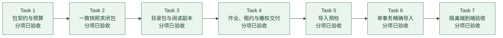
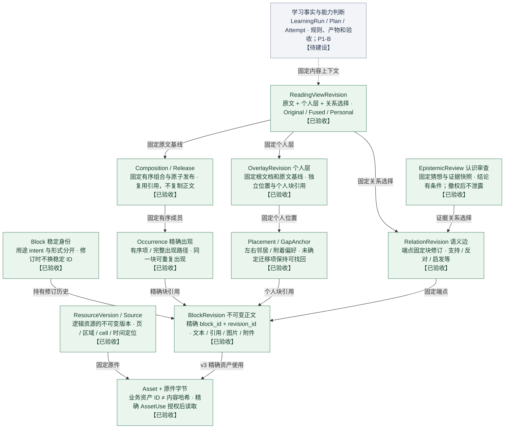
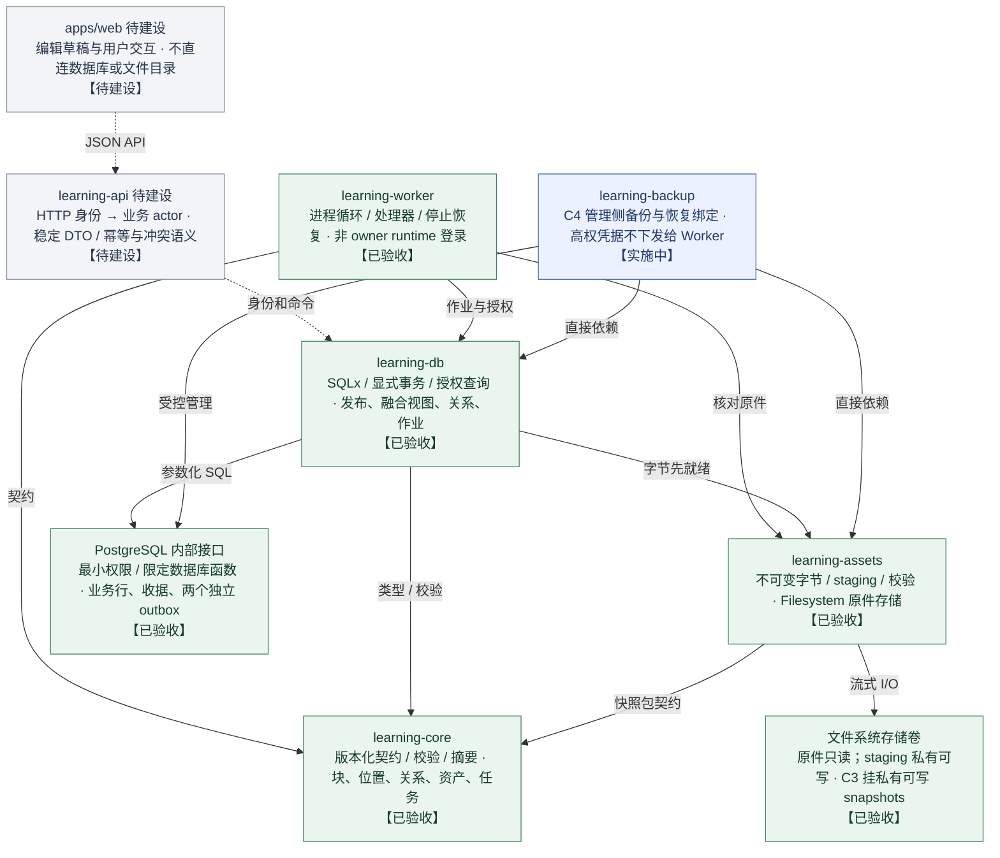
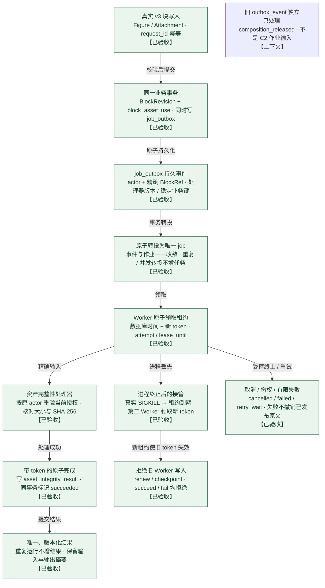
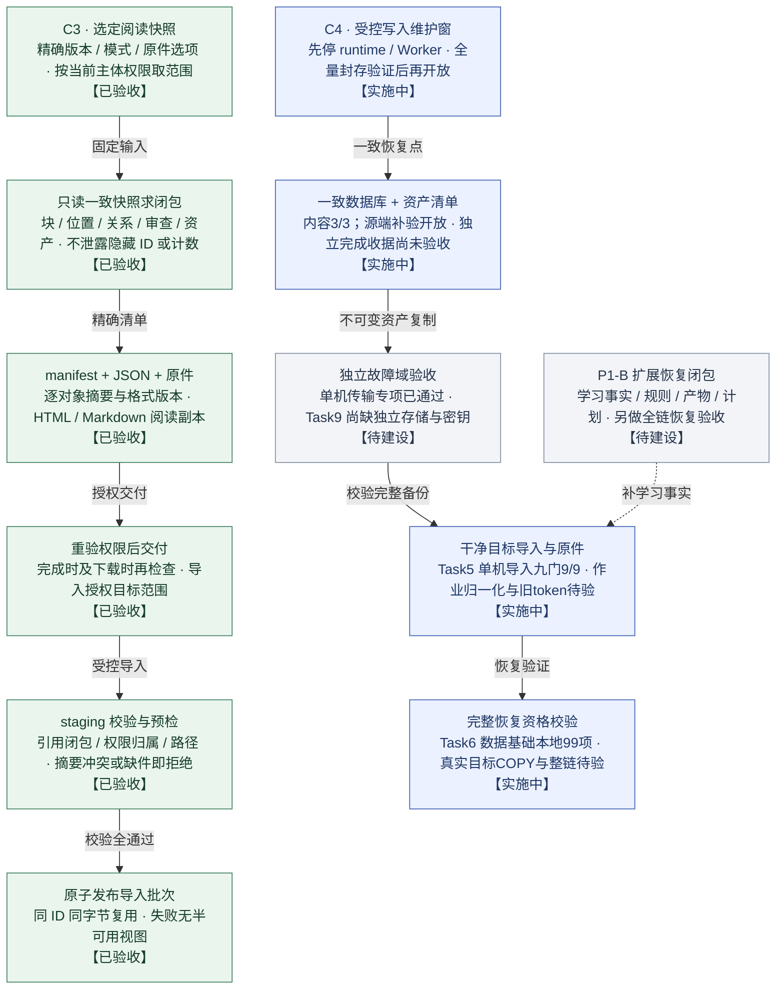
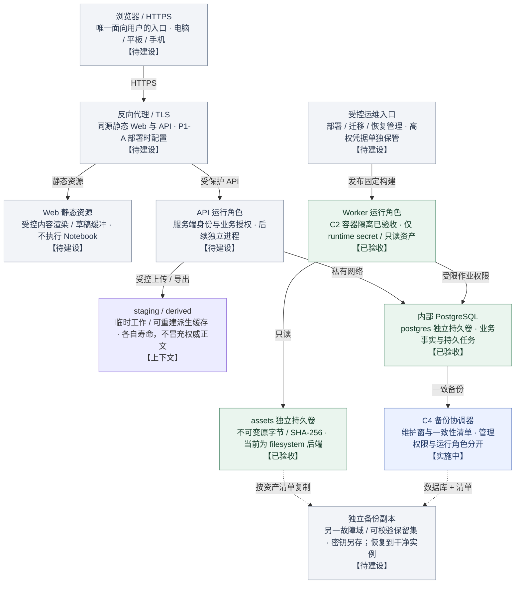

# 知织 · KnowWeave｜实施路线与系统架构

更新：2026-10-10。当前状态：C4 补验实施中 · Task2/3/5推进 · Task5单机导入9/9已核验，`NOT_PRODUCTION`。C3 验收源码 HEAD：`3342c0554c18787749d0f06a772743f867c18720`；当前本地源码检查点：`0b6f2a59a25b4a09bf9e30c085d079d4b0d7b399`。现场验收源码与当前 WIP 不混用。

面向个人长期学习、支持多领域复用的服务器应用。以可独立修订的块为核心，将原文、笔记、图片、想法与猜想连续编排；版本、位置、关系、证据与学习事实各自留存。

这是截至 2026-10-10 的实施进度与目标架构。当前现场源码快照与下方历史发布证据分别标注。绿色表示已验收阶段，蓝色表示实施中但尚未完成整关验收，灰色表示待建设，紫色表示按需求选择；连线表示依赖或数据流，不表示图中的全部功能已上线。

[离线图文版](../KnowWeave实施路线与架构.html)。此文为可编辑 Markdown 快照；可维护图数据在 .build/knowweave-map.data.mjs（私有或未公开参考），生成命令为 `node .build/build-knowweave-map.mjs`。

## 实施路线

P0-A、B1–B4、C1–C3 共 8 个分关已验收。2026-10-10：Task2缺失source-dump-failure真实1/0/0与独立verify、1414份Suite原件/466组进程记录、5次namespace/22组关联RPC、14字段证明及46MB测试二进制均已核验；正确读取器操作原件与精确ID移除闭合，故障分项补验收尾完成。历史正常用例UNKNOWN及当前组合回归仍开放，整个Task2未关闭。Task3限定代码与单机证据收尾复审通过：当前8个相关Git blob与已验版本一致，本地16项及历史两个Linux文件门分列，真实独立目标归Task9。Task5旧九项9/9原件保留，当前旧11门0/11；首门适配0b6f2a59与修正adapter独立CODE复审通过，安装/仅计划V2输出边界修正已通过限定Ops复审与124份封存哈希核对；外层保护V2限定Ops复审通过；V1首次只读预检拒绝且未安装，V2现场安装与独立物理采纳仍待执行。Task6本地99项通过但真实COPY/作业SQL/资格未接入；Task7/8整链、最终回归/四套升级/整分支审查及Task9独立存储待完成，P0-C4未完成。

不用分关数量或累加测试数估算整个项目完成百分比；各阶段历史测试数不能相加。

```mermaid
flowchart LR
    M0["P0-A<br/>块修订与权限<br/>已验收"]
    M1["P0-B1<br/>组合与原子发布<br/>已验收"]
    M2["P0-B2<br/>个人层与融合阅读<br/>已验收"]
    M3["P0-B3<br/>关系与认识审查<br/>已验收"]
    M4["P0-B4<br/>读取投影与影响查询<br/>已验收"]
    M5["P0-C1<br/>原件、图片与附件<br/>已验收"]
    M6["P0-C2<br/>持久任务与受限 Worker<br/>已验收"]
    M7["P0-C3<br/>融合快照交换<br/>已验收"]
    M8["P0-C4<br/>完整备份与干净恢复<br/>实施中"]
    M9["P1-A<br/>登录、API 与内容工作台<br/>待建设"]
    M10["P1-B<br/>学习与实践闭环<br/>待建设"]
    M11["P2<br/>批量演进与多领域复用<br/>待建设"]
    M12["P3<br/>按需求增强<br/>可选"]
    M0 --> M1
    M1 --> M2
    M2 --> M3
    M3 --> M4
    M4 --> M5
    M5 --> M6
    M6 --> M7
    M7 --> M8
    M8 --> M9
    M9 --> M10
    M10 --> M11
    M11 --> M12
```



| 阶段 | 状态 | 交付 | 验收门 | 证据或范围 |
| --- | --- | --- | --- | --- |
| P0-A 块修订与权限 | 已验收 | 稳定块身份、不可变修订、当前授权、幂等请求和并发冲突。 | 真实 PostgreSQL 权限、重复写入、冲突与回滚验证。 | [29/29；已验收](p0a-verification.md) |
| P0-B1 组合与原子发布 | 已验收 | 固定组合、重复出现的独立 occurrence、精确版本引用及原子发布。 | 两文档复用一个块；只升级指定组合；旧发布仍可复现。 | [68/68；已验收](p0b1-verification.md) |
| P0-B2 个人层与融合阅读 | 已验收 | 间隙插入、个人位置、原文/融合/个人投影及固定阅读修订。 | 位置与正文同步保存；移动不改原文；无法迁移的内容可找回。 | [105/105；已验收](p0b2-verification.md) |
| P0-B3 关系与认识审查 | 已验收 | 支持/反对等关系、猜想版本与证据判断、派生/拆分/合并谱系。 | 隐藏证据不泄露；猜想新版不自动继承旧判断。 | [222/222；已验收](p0b3-verification.md) |
| P0-B4 读取投影与影响查询 | 已验收 | 固定范围反向引用、关系遍历、解释路径与有界查询。 | 按当前权限过滤；隐藏桥不扩展；截断和失败明确区分。 | [284 通过 / 3 忽略；已验收](p0b4-verification.md) |
| P0-C1 原件、图片与附件 | 已验收 | 不可变原字节、资源版本定位、v3 图片/附件及精确使用授权。 | 独立卷原字节核验；中断/损坏/回滚/撤权；四套旧程序升级。 | [328 通过 / 3 忽略；已验收](p0c1-verification.md) |
| P0-C2 持久任务与受限 Worker | 已验收 | 同事务事件、持久转投、数据库租约、有限重试、资产完整性处理器。 | 专用 Worker 真 SIGKILL/接管/取消/撤权；旧 token 拒绝；唯一结果。 | [388 通过 / 0 失败 / 3 忽略；965 份证据哈希一致](p0c2-verification.md) |
| P0-C3 融合快照交换 | 已验收 | 精确 Reading 快照、版本化目录包与可选原件；导入前校验、原子可见。 | 授权闭包往返；缺件/篡改/撤权/同 ID 不同字节拒绝；不出现半可见视图。 | [整关隔离验收与 602 份证据哈希复核通过；未生产部署](p0c3-verification.md) |
| P0-C4 完整备份与干净恢复 | 实施中 | 受控写入维护窗、数据库一致性备份、资产闭包、异机副本、干净实例恢复。 | 固定历史、个人间隙、关系/审查、权限与原件一致；残缺备份不得标 complete。 | [Task1已验收；Task4内容3/3；Task5单机导入9/9已核验；Task6作业恢复实施中；整关尚未闭合](p0c4-verification.md) |
| P1-A 登录、API 与内容工作台 | 待建设 | HTTP 身份/会话、稳定 DTO、连续阅读、块编辑、插入图片笔记与历史冲突处理。 | 真实浏览器端到端；跨设备读取服务端保存；冲突保留草稿；HTTP/资产授权。 | [待建设；首次形成浏览器内容工作台](设计批准与实施路线.md) |
| P1-B 学习与实践闭环 | 待建设 | 学习单元、计划、任务、尝试、产物、验收、复习；接入首批真实资料。 | 今日任务→阅读实践→提交产物→条件化验收；关闭 AI 仍可用；补学习事实恢复。 | [待建设；通过后形成完整学习系统试用版](学习系统设计方案.md) |
| P2 批量演进与多领域复用 | 待建设 | 批量内容升级、迁移候选处理、第二领域、规则推荐与计划调整。 | 真实资料更新保留旧事实；第二领域不新增专属核心业务流程。 | [待建设](学习系统设计方案.md) |
| P3 按需求增强 | 可选 | AI 辅助、OCR/预览等解析器、语义检索；独立评估 S3 和 Neo4j 可重建投影。 | 来源/版本可追溯、权限不绕过、失败可降级；按测量结果决定引入。 | [可选增强；不是首版必装组件](数据库选型实验审阅与首版决策.md) |

## 当前阶段 C4：九任务补齐计划

任务编号依据 [2026-10-04 补齐计划](superpowers/plans/2026-10-04-p0c4-completion.md)，与下面原五任务父里程碑分开。分项通过不关闭父里程碑或 C4。

2026-10-10：Task2缺失source-dump-failure真实1/0/0与独立verify、1414份Suite原件/466组进程记录、5次namespace/22组关联RPC、14字段证明及46MB测试二进制均已核验；正确读取器操作原件与精确ID移除闭合，故障分项补验收尾完成。历史正常用例UNKNOWN及当前组合回归仍开放，整个Task2未关闭。Task3限定代码与单机证据收尾复审通过：当前8个相关Git blob与已验版本一致，本地16项及历史两个Linux文件门分列，真实独立目标归Task9。Task5旧九项9/9原件保留，当前旧11门0/11；首门适配0b6f2a59与修正adapter独立CODE复审通过，安装/仅计划V2输出边界修正已通过限定Ops复审与124份封存哈希核对；外层保护V2限定Ops复审通过；V1首次只读预检拒绝且未安装，V2现场安装与独立物理采纳仍待执行。Task6本地99项通过但真实COPY/作业SQL/资格未接入；Task7/8整链、最终回归/四套升级/整分支审查及Task9独立存储待完成，P0-C4未完成。

接入有界外部归并排序与同一目标COPY，完成合法作业状态迁移、旧token失效、未知副作用持久隔离及恢复收据。外部快照证据的版本化协议仍是待审方案，不能改写v1证明或用缺文件推导无副作用。随后执行Task6实际Linux/PG五门与独立审查、Task7 Attention整链、Task8当前回归/四套旧版升级/整分支审查。Task9缺真实独立存储与密钥托管，整体C4仍未完成。

Task2缺失故障分项Root最终采纳SHA a75b3881…；读取器前后203个旧PG、严格源PG及保留失败读取器状态均保持，成功读取器仅按实际ID移除。Task5旧九项源码96568f8与Root汇总d3ecb48f…保留。新首门0b6f2a59：539个相同Git源码文件/每种ZIP540成员，15迁移原字节，后继bundle027a761f…与Root逐字节采纳2acafde5…；CODE限定复审d3f3934b…，未知持锁进程8项真实检查通过。不同本地命令有重叠，不相加为现场用例。旧WSL三个mock错误仍按d4基线分列。Task3当前Windows16项与旧E8 Linux两项分列。Task6真实Linux RED/独立复审未完成；不代表整链、CompleteBackup或生产。

```mermaid
flowchart LR
    C4T1["Task 1<br/>持久登记与原件保护<br/>限定分项已验收"]
    C4T2["Task 2<br/>精确源端绑定与捕获监督<br/>缺失故障门已收尾，正常门开放"]
    C4T3["Task 3<br/>保留校验与完成收据<br/>单机补验收尾复审通过，外部门开放"]
    C4T4["Task 4<br/>全量模式与有界 COPY 数据<br/>内容三门已验收"]
    C4T5["Task 5<br/>受控整库导入与原件恢复<br/>九项已核验，首门CODE通过"]
    C4T6["Task 6<br/>作业归一化与恢复资格校验<br/>本地基础通过，现场门待验"]
    C4T7["Task 7<br/>完整 Attention 链与负例<br/>未开始"]
    C4T8["Task 8<br/>当前回归、旧版升级与审查<br/>未开始"]
    C4T9["Task 9<br/>真实独立故障域闭合<br/>待具备独立存储"]
    C4T1 --> C4T2
    C4T2 --> C4T3
    C4T3 --> C4T4
    C4T4 --> C4T5
    C4T5 --> C4T6
    C4T6 --> C4T7
    C4T7 --> C4T8
    C4T8 --> C4T9
    class C4T1,C4T4 done
    class C4T2,C4T3,C4T5,C4T6 next
    class C4T7,C4T8,C4T9 planned
    classDef done fill:#eaf5ee,stroke:#438363,color:#173d2b
    classDef next fill:#ebf1ff,stroke:#4365b4,color:#203866
    classDef planned fill:#f2f4f8,stroke:#8591a3,color:#28354b
```



| 任务 | 状态 | 工作与验收依据 |
| --- | --- | --- |
| Task 1 · 持久登记与原件保护 | 限定分项已验收 | 登记资产与本地 pin 根身份；独立发现保留保护，缺失或不完整时拒绝清理候选。 固定 Linux/PG 登记保护门 11/11 与五项文件系统门通过；本任务不签发完整备份，也不关闭 C4。 |
| Task 2 · 精确源端绑定与捕获监督 | 缺失故障门已收尾，正常门开放 | 源捕获绑定实际容器、命名空间、套接字和已准入会话；错误端点须在日志、ACL 与 dump 变更前拒绝。 不可变d4包缺失source-dump-failure真实1/0/0、独立verify、1414份原件/466组进程记录、5次namespace/22组关联RPC、14字段证明/二进制/读取器原件均已采纳。前后旧PG/源PG/失败读取器保持。历史b6a/E8分列；正常正例UNKNOWN与当前组合回归仍开放，整个Task2未关闭。 |
| Task 3 · 保留校验与完成收据 | 单机补验收尾复审通过，外部门开放 | 校验封存包和保留集；真实首签与新发布入口默认关闭，跨操作权限、独立目标和密钥托管归Task9。 本轮当前Windows16项通过，8个相关Git blob同已验版本，限定代码与单机证据收尾复审通过；历史E8两项Linux目标文件校验/中断传输已核验，属于合成历史分项，未签发真实完成收据。不同源码/平台分别留证，不用可见残留推导CompleteBackup。 |
| Task 4 · 全量模式与有界 COPY 数据 | 内容三门已验收 | 完整审查模式、固定客户端/TOC 与有界 COPY 字节；函数/ACL 篡改拒绝，数据中的 SQL 外观不变成命令。 真实 PG18 内容三门 3/3 已核验；本分项不等于完整恢复资格或整关验收。 |
| Task 5 · 受控整库导入与原件恢复 | 九项已核验，首门CODE通过 | 干净目标受控导入与原件闭包；失败保持隔离。新首门0b6f2a59与adapter复审通过，安装/计划V2输出投影复审通过；外层保护和独立物理采纳候选收尾后现场验固定success。 96568f8九项实际9/9及19878份原件/6563组进程记录保留。新首门539个Git源码文件逐字节关联，持锁进程真实8项检查通过；本地计数不加为PG，旧11门仍0/11，其余10暂拒绝。Task6资格与Task8最终回归未关闭。 |
| Task 6 · 作业归一化与恢复资格校验 | 本地基础通过，现场门待验 | 全表数据比对、旧租约/token 失效、未知副作用持久隔离、恢复收据；全部成立后才可判定可用。 WIP d4b97df：64张表数据观察基础及queued策略修复，本地87+12=99项通过，其中新增17项。真实目标COPY/外部排序与作业SQL未接入；独立审查、Linux/PG五门未完成。 |
| Task 7 · 完整 Attention 链与负例 | 未开始 | 完整备份—导入—恢复校验；原件、历史、位置、关系、权限和失败前不写入等整链核对。 当前整链尚未验收；Task5九门与历史受控小型dump结果不能代替本任务。 |
| Task 8 · 当前回归、旧版升级与审查 | 未开始 | 当前源码旧11门/源端缺口、完整工作区、四套真实旧版升级、严格检查、整分支独立审查与受控发布。 当前完整门未执行；Task6独立审查尚待完成。文档刷新与本地测试不授予全量回归或发布信用。 |
| Task 9 · 真实独立故障域闭合 | 待具备独立存储 | 使用独立主机、NAS 或对象存储并单独保管密钥，完成真实完成收据与干净恢复演练。 用户选择先完成代码与单机整链，目前没有真实独立备份目标；P0-C4整体、CompleteBackup与生产继续开放。 |

### 原五任务父里程碑（保留原编号）

对应 [2026-09-28 父计划](superpowers/plans/2026-09-28-p0c4-backup-recovery.md)，下表不是当前九任务的编号或完成计数。原 Task3–5 的完整门继续开放。

| 父里程碑 | 状态 | 工作与当前边界 |
| --- | --- | --- |
| 原 Task 1 · 全量备份契约与资产清单 | 分项已验收 | 版本化 manifest、规范摘要与全部 ready 资产目录；规划不冒充完成备份。 独立复审及全新 PG18 专项通过，含普通角色拒绝；C4 整关未验收。 |
| 原 Task 2 · 安全封存与目标端校验 | 分项已验收 | 私有 staging、流式复制核哈希、no-follow 与封存；中断不发布可恢复包。 Linux 专项及 SIGKILL/部分写入故障门通过；同步故障使用测试钩子，非真实掉电证明。 |
| 原 Task 3 · 维护窗与一致性数据库备份 | 实施中 | 受控写闸、在途排空、一致 dump 与资产清单；由补齐计划Task1–3继续完成。 历史源生命周期八主门与legacy、单机传输分项已接受；当前源端补验、独立目标、完成收据及父里程碑仍开放。 |
| 原 Task 4 · 干净实例恢复 | 实施中 | 目标准入、出生证明、精确端点绑定与完整导入；由补齐计划Task4–6继续完成。 历史只读会话、同ID/OID物理克隆与同guard重启拒绝门保留；当前Task5整库导入九门9/9及原件正例已核验。Task6数据基础本地99项通过，但作业归一化/完整恢复资格与父里程碑尚未验收。 |
| 原 Task 5 · 完整场景与故障注入验收 | 未开始 | 完整 Attention、当前完整回归、四套旧版升级与整分支审查；由补齐计划Task7–9闭合。 当前整链、全量回归与独立故障域尚未闭合，仍未生产部署。 |

## C3 历史：七任务实施线

Task 1–7 已完成分项审查与隔离验证；Task 7 的完整 Linux/PostgreSQL/Worker 证据经 root 私有只读审计复核，C3 标记为 `P0_C3_VERIFIED / NOT_PRODUCTION`。



| 任务 | 状态 | 工作与验收依据 |
| --- | --- | --- |
| Task 1 · 包契约与预算 | 分项已验收 | 版本化 manifest、精确对象身份与摘要、阅读副本隔离、封闭预算。 代码与独立复审完成；最终纳入 C3 整关验收。 |
| Task 2 · 一致快照求闭包 | 分项已验收 | 在单个只读事务中固定 Reading、引用、关系、审查和资产使用，并按当前授权过滤。 全新隔离 PostgreSQL：专项 9/9、相关回归 15/15。 |
| Task 3 · 目录包与阅读副本 | 分项已验收 | 私有 staging、流式核哈希、Linux no-follow 与受控句柄交付；阅读副本去身份化。 独立复审通过；全新隔离 Linux 专项 38/38。 |
| Task 4 · 作业、租约与撤权交付 | 分项已验收 | 追加 C3 作业类型与迁移；复用租约 fencing，完成和交付时重新核验授权。 独立复审通过；全新隔离 PostgreSQL 专项 18/18、C2 回归 39/39、Worker 11 项及 0013→0014 升级通过；修复已并入主工作树。 |
| Task 5 · 导入预检 | 分项已验收 | 校验版本、路径、摘要、身份冲突、引用闭包及目标资产存在性。 夹具修复后独立复审通过；全新隔离项目 Task 5 12/12，相关回归合计 86 项、格式/严格 Clippy 通过。 |
| Task 6 · 单事务精确导入 | 分项已验收 | 同 ID 同字节幂等复用，冲突拒绝；结果原子可见且可追溯。 第三轮新隔离 PostgreSQL 专项 3/3、指定回归与 fmt/严格 Clippy 通过；旧夹具失败和缺冻结清单的 101 均保留证据。 |
| Task 7 · 隔离端到端验收 | 分项已验收 | 完整往返、故障注入、撤权、旧版升级、全工作区与独立复审。 全量 result SHA c939cc71…；602 份证据哈希一致；整关已验收，未生产部署。 |

## 全局约束

- **权威分层**：PostgreSQL 是结构化业务权威；assets 是原字节权威；派生缓存、导出阅读副本和未来 Neo4j 投影均可重建或重新生成。
- **版本不漂移**：Block 稳定 ID、修订 ID、组合发布、个人层、关系选择与学习快照分别留存。更新产生候选；是否采用新版由明确操作决定。
- **授权贯穿链路**：正文、必要引用、位置、关系、影响路径和精确资产使用都核对当前权限；HTTP、搜索与导出必须在后续阶段继承并另验此语义。
- **知识证据与学习证据分开**：支持/反对关系和认识审查已有内核；学习任务、尝试、产物、评分规则、能力验收尚属 P1-B。阅读完成不会自动成为通过。
- **模块化单体**：crate 分职责，API 与 Worker 可分进程；首版无需 Kafka、Redis、Kubernetes、向量数据库或常驻 Neo4j。
- **生产状态诚实**：C3 已通过隔离整关验收；C4 单机导入九项场景已核验，恢复资格、Attention 整链、独立存储和整关尚未验收；Task6 本地测试不等于 PostgreSQL 现场验证。P1 尚未实施，生产未部署。

## 01 · 全系统架构总览

模块化单体：共享业务契约，API 与 Worker 分进程；首版单机部署。

[独立矢量图](diagrams/knowweave-overview.svg) · [Mermaid 源码](diagrams/knowweave-overview.mmd)

```mermaid
flowchart TB
    user["个人学习者<br/>电脑 / 平板 / 手机 · 跨设备访问同一服务<br/>【上下文】"]
    web["Web 学习工作台<br/>阅读 · 编辑 · 图谱 · 今日 · P1-A / P1-B 待建设<br/>【待建设】"]
    sources["课程与实践来源<br/>PDF / PPTX / Notebook / 代码 · 原格式资料与实验产物<br/>【上下文】"]
    learning["学习与计划模块<br/>单元 / 任务 / 尝试 / 验收 · P1-B；规则推荐延伸到 P2<br/>【待建设】"]
    api["Rust HTTP / 身份边界<br/>会话 · DTO · 授权入口 · P1-A；Axum 为建议<br/>【待建设】"]
    import["交换与导入入口<br/>C3 授权快照；P1-B 首批资料 · 批量来源更新在后续阶段<br/>【待建设】"]
    content["内容与关系内核<br/>块 / 组合 / 个人层 / 审查 · P0-A / B1–B4 已验收<br/>【已验收】"]
    jobs["持久任务与 Worker<br/>job_outbox → job → 租约 · C2 资产完整性已验收<br/>【已验收】"]
    assetapi["资产与来源模块<br/>资源版本 · 精确使用授权 · C1 原字节与 v3 图片/附件<br/>【已验收】"]
    pg["PostgreSQL 权威库<br/>结构化正文与关系 / 作业状态 · SQLx · 事务 · 追加迁移<br/>【已验收】"]
    derived["可重建派生层<br/>预览 / OCR / 搜索 / 检索片段 · 处理器与索引后续按需建设<br/>【可选】"]
    files["不可变原件库<br/>assets/sha256 · 独立持久卷 · staging 与原件分区<br/>【已验收】"]
    portable["C3 / C4 可移植性<br/>C3 范围导出已验收 · C4 全量恢复实施中<br/>【实施中】"]
    graph["Neo4j 可选投影<br/>首版不常驻 · 来源仍为 PostgreSQL<br/>【可选】"]
    ai["可选 AI / 外部执行<br/>仅建议；实验默认外部运行 · 关闭后不影响核心流程<br/>【可选】"]
    user -- "访问" --> web
    web -- "同源 API" --> api
    sources -- "登记 / 受控导入" --> import
    api -- "业务调用" --> learning
    api -- "校验与编排" --> content
    import -- "原件与引用" --> assetapi
    content -- "事务读写" --> pg
    assetapi -- "校验 / 定稿 / 授权读取" --> files
    assetapi -- "元数据 / 精确使用 / 授权" --> pg
    learning -. "学习事实" .-> pg
    jobs -- "转投 / 租约 / 结果" --> pg
    jobs -- "复用精确授权" --> assetapi
    jobs -. "未来处理器" .-> derived
    files -- "原字节闭包" --> portable
    pg -- "闭包与一致快照" --> portable
    pg -. "可重建投影" .-> graph
    derived -. "按需适配" .-> ai
    class content,jobs,assetapi,pg,files done
    class portable next
    class web,learning,api,import planned
    class derived,graph,ai optional
    classDef done fill:#eaf5ee,stroke:#438363,color:#173d2b
    classDef next fill:#ebf1ff,stroke:#4365b4,color:#203866
    classDef planned fill:#f2f4f8,stroke:#8591a3,color:#28354b
    classDef optional fill:#f3ecfb,stroke:#9271b0,color:#4a3362
```

- 浏览器工作台、HTTP 登录和学习闭环均为待建设。React + TypeScript + Vite、Axum 是建议组合，尚未作为已实施依赖固化。
- PostgreSQL 保存身份、修订、权限、位置、关系和任务状态；文件卷保存不可变原件。JSON/Markdown/HTML 是交换或阅读副本。
- 知识关系图由 PostgreSQL 数据构建；Neo4j 如以后采用，只作为可重建投影。AI 不决定权威知识和验收事实。

## 02 · 块、位置与版本关系

箭头统一由持有者或引用者指向目标；省略部分约束字段，不把对象画成独立服务。

[独立矢量图](diagrams/knowweave-domain.svg) · [Mermaid 源码](diagrams/knowweave-domain.mmd)



- 稳定 ID 与不可变修订 ID 分开；正式发布和阅读快照固定修订，不随 head 自动漂移。相同字节哈希也不会自动合并业务身份。
- 一次出现由 occurrence 或 placement 标识；正文修订与位置移动是不同操作。个人层固定原文基线，不改写原文。
- 关系/认识审查属于已实现的知识证据内核；学习任务的尝试、产物与能力验收属于未来 P1-B，不能混为已完成。
- 当前正文支持 v1 文本、v2 文本/块引用/关系视图、v3 图片/附件。独立公式、代码、表格、练习、评分规则等更多类型仍需各自契约与验收。

## 03 · Rust 代码与授权边界

实线显示现有模块依赖与运行接口；虚线表示未来接入。crate 是代码模块，不是独立网络服务。

[独立矢量图](diagrams/knowweave-crates.svg) · [Mermaid 源码](diagrams/knowweave-crates.mmd)



- 已核对当前 C4 Cargo workspace：core、assets、db、worker、backup 五个 crate。learning-backup 仍在 C4 实施，直接依赖 db/assets。Worker → db/assets/core；db → assets/core；assets → core。assets 不负责业务 actor 授权。
- Worker 原件与二进制只读，staging 私有可写；C3 另挂服务所有的私有可写 snapshots 卷，管理凭据不进入普通 Worker。
- 数据库 runtime 是可信内部服务角色，非每位最终用户或每个 Worker 的独立数据库租户。用户权限由业务 actor、当前空间授权和必要引用闭包共同判定。
- 两项 P2 契约缺口已记录：持当前 token 的共享 runtime 可调用通用 succeed 而不写专用结果；也可直接调用完成函数绕过 Rust 字节复核。正常 Worker 已验收路径使用原子结果函数。这里 P2 是问题优先级，不表示已安排在路线 P2 阶段。
- 旧 outbox_event 只保存 composition_released，C2 的 job_outbox / job 是独立协议；图与实现均不把两者合并成一张通用队列表。

## 04 · 持久任务与真实故障恢复

C2 已验收路径：新事件来自精确 v3 块资产使用，采用至少一次执行与幂等结果。

[独立矢量图](diagrams/knowweave-jobs.svg) · [Mermaid 源码](diagrams/knowweave-jobs.mmd)



- 仅登记资产、仅关联资源版本或旧发布 outbox，不会自动创建这类资产检查任务。正文和事件同事务提交；旧请求收据重放不增事件。
- claim 使用 PostgreSQL 时钟和数据库生成 token。续租、检查点、成功和失败都校验当前 token；最多三次尝试，取消与终态不复活。
- 专用 Worker 只挂 runtime secret、只读资产与只读二进制；真实 SIGKILL 后第二 Worker 接管 attempt 2，旧 token 的四种写入均被拒绝。
- 完整性处理只核大小、SHA-256 与轻量元信息，不宣称已实现预览、OCR、完整媒体解析或恶意文件扫描。

## 05 · C3 交换与 C4 恢复

C3 阅读快照交换已验收；C4 单机导入九项场景已核验，作业与完整恢复资格校验实施中，整关尚未验收。

[独立矢量图](diagrams/knowweave-portability.svg) · [Mermaid 源码](diagrams/knowweave-portability.mmd)



- C3 Task 1–7 已完成分项与整关隔离验收：Task 7 在全新 Compose 项目通过完整 workspace、四套旧版升级、真实 Worker SIGKILL/租约接管、双端往返和四组失败注入。独立 root 只读审计核验 602 份证据文件、341 个源码文件、301 项镜像输入；状态为 P0_C3_VERIFIED / NOT_PRODUCTION。
- C3 输入为精确 ReadingViewRevision、模式和原件选项；当前授权求闭包，作业结束与交付时再次检查。已下载的文件无法被服务器远程撤回。
- 无损交换以版本化 JSON 与 manifest 为准；HTML/Markdown 是阅读副本。导入同 ID 同字节幂等复用，不同字节拒绝。
- 2026-10-10：Task2缺失source-dump-failure真实1/0/0与独立verify、1414份Suite原件/466组进程记录、5次namespace/22组关联RPC、14字段证明及46MB测试二进制均已核验；正确读取器操作原件与精确ID移除闭合，故障分项补验收尾完成。历史正常用例UNKNOWN及当前组合回归仍开放，整个Task2未关闭。Task3限定代码与单机证据收尾复审通过：当前8个相关Git blob与已验版本一致，本地16项及历史两个Linux文件门分列，真实独立目标归Task9。Task5旧九项9/9原件保留，当前旧11门0/11；首门适配0b6f2a59与修正adapter独立CODE复审通过，安装/仅计划V2输出边界修正已通过限定Ops复审与124份封存哈希核对；外层保护V2限定Ops复审通过；V1首次只读预检拒绝且未安装，V2现场安装与独立物理采纳仍待执行。Task6本地99项通过但真实COPY/作业SQL/资格未接入；Task7/8整链、最终回归/四套升级/整分支审查及Task9独立存储待完成，P0-C4未完成。
- 接入有界外部归并排序与同一目标COPY，完成合法作业状态迁移、旧token失效、未知副作用持久隔离及恢复收据。外部快照证据的版本化协议仍是待审方案，不能改写v1证明或用缺文件推导无副作用。随后执行Task6实际Linux/PG五门与独立审查、Task7 Attention整链、Task8当前回归/四套旧版升级/整分支审查。Task9缺真实独立存储与密钥托管，整体C4仍未完成。
- 早期 C4 源端、Linux 封存/单机传输、目标准入与精确子进程只读子门记录保留；历史受控小型 dump 计划中的 Task6 只覆盖固定合成夹具，与当前九任务计划的 Task6 作业恢复不同。历史维护三门、准入五门、绑定四门及两项回归分别绑定原源码/批次，不能累计为当前源码组合通过数。
- 当前 Task5 九门覆盖完整导入、提交前 EOF、取消、提交结果未知、错误数据库路由、坏输入、坏角色、脏目标与损坏原件；错误路由门不是同身份物理克隆门。Task6 的 99 项是本地测试；真实目标 COPY、作业归一化、恢复资格与新 Linux/PG 门尚待完成。
- C4 首先恢复现有内容事实；P1-B 后还必须把学习任务、尝试、产物、验收与计划历史加入完整恢复闭包。

## 06 · 目标部署与存储边界

目标为私有单机 Linux + Compose。现有证明来自隔离验收环境，未部署成生产服务。

[独立矢量图](diagrams/knowweave-deployment.svg) · [Mermaid 源码](diagrams/knowweave-deployment.mmd)



- C4 源控制根绑定已在单可信容器命名空间实测；独立签发/每部署编译 pin 不构成宿主生产安装流程，独立存储故障域仍延后。
- 只有 HTTPS 入口面向浏览器；数据库、文件卷和高权管理入口不直接公开。API 与 Worker 复用业务代码而采用不同运行职责。
- C2 专用 Worker 容器以非 root 运行、只读根文件系统、私有 tmpfs，限制资源；管理 secret 不在 Worker 文件系统中。宿主 root / Docker daemon 仍属于可信管理边界。
- assets 是权威原字节；staging 是未完成工作；derived 是可重建派生物；验收 evidence 保存此次测试证据，并不等于将来学习产物的数据库模型。
- 生产前明确门槛：完成 C4 恢复演练、P1-A 会话及 HTTP 授权；修复并验证服务器时间同步；处理已记录 runtime 契约缺口；按实际服务补日志、容量、升级与备份检查。

## 状态依据

- [项目架构设计文档集](KnowWeave架构设计总览.md)
- [批准记录与阶段边界](设计批准与实施路线.md)
- [总体设计 v0.3](学习系统设计方案.md)
- [块与存储规范](内容分块与存储规范.md)
- [连续阅读与思考块](连续阅读与思考块设计.md)
- P0-C 分关设计（私有或未公开参考）
- [C3 实施计划与任务边界](superpowers/plans/2026-09-24-p0c3-snapshot-exchange.md)
- [C3 目录包格式说明](snapshot-directory-v1.md)
- [C3 整关验证台账](p0c3-verification.md)
- [C4 当前补齐设计](superpowers/specs/2026-10-04-p0c4-completion-design.md)
- [C4 当前九任务补齐计划](superpowers/plans/2026-10-04-p0c4-completion.md)
- Task5 九项现场原件核验汇总（私有或未公开参考）
- Task6 本地检查点与未完成边界（私有或未公开参考）
- [当前Task2/3/5补验与收尾](P0-C4补验与收尾.md)
- [C4 父设计（2026-09-28）](superpowers/specs/2026-09-28-p0c4-backup-recovery-design.md)
- [C4 原五任务父计划（里程碑编号）](superpowers/plans/2026-09-28-p0c4-backup-recovery.md)
- [C4 历史验证台账（原源码/批次）](p0c4-verification.md)
- [历史维护闸补充验证](p0c4-maintenance-gates.md)
- [历史源尝试生命周期运行说明](p0c4-source-attempt-lifecycle.md)
- [历史源控制根绑定与实际四门](p0c4-source-control-binding.md)
- [历史活会话维护准入与五门](p0c4-source-admission.md)
- [C4 子进程端点绑定施工单](superpowers/plans/2026-09-29-p0c4-pg-restore-child-binding.md)
- [C2 验收与已知边界](p0c2-verification.md)
- [当前 C4 Cargo workspace](../Cargo.toml)
- [Neo4j 首版决策](数据库选型实验审阅与首版决策.md)

### 历史证据的范围

历史live admission五门5/5属2026-10-03基于0adab2e的working-tree-green，后续a56ab16为公开源码基线；原批06a0882f结果SHA98b0883bef44abe10259006e34b5481e322fac38511421b35c37d56afd74cd98。旧c9f1cdaf维护三门3/3属07eaf416，结果SHA698eebc766e6aa137f7622111c456422f23d451ad8eee48a00f89275e216fc71。旧五门/三门不与当前四绑定门、两回归合并为同源计数。41f658ea Clippy基础设施失败和b2a63c86实际ACL行为RED均保留，不重放。Windows workspace--lib185、免环境contract28与Python331总数/324pass7skip分开记录；full package catalog_pg missing-env失败保留，不称完整DB/升级通过。

历史只读子进程绑定、同身份物理克隆与同 guard 重启拒绝证据保留。当前 Task5 九门中的错误端点场景为错误数据库路由，不能替代历史克隆或当前源端监督门；Task8 须验证当前源码回归。

路线图只更新文档与图示；生产未部署，CompleteBackup、完整恢复资格与 C4 整关未验收。六张 SVG 与 Mermaid 源码、HTML 与 Markdown 共 14 份输出由同一数据生成；本轮验证生成确定性、文本状态、链接和 SVG 几何，浏览器渲染与交互未验证。
