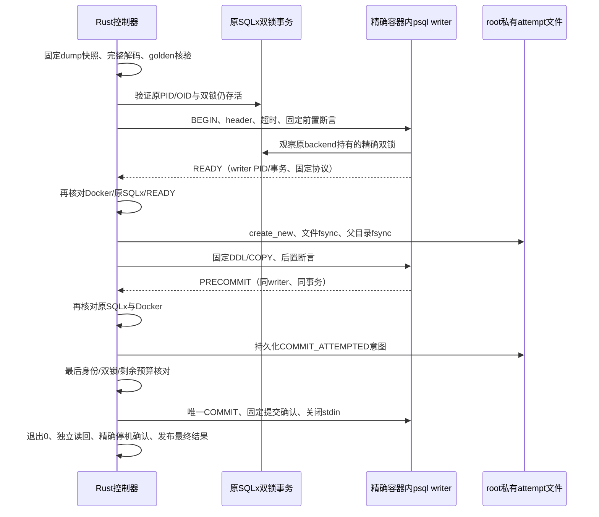

# P0-C4 受控小型 dump 首次写入设计

**状态：用户已批准设计；施工计划待审阅，尚未开始实现或服务器写入验收。**

日期：2026-09-30。代码基线：`e2435e474e03e6d428b3f4cb2f5d5b4f91e94cca`。承接 [只读子进程设计](2026-09-29-p0c4-pg-restore-child-binding-design.md)、[已完成施工单](../plans/2026-09-29-p0c4-pg-restore-child-binding.md) 和 [C4 验证记录](../../p0c4-verification.md)。

## 1. 目标与当前证据

用户希望继续推进 C4，沿用 Rust、逐任务子代理实现和独立审查、逐文件授权新服务器批次的方式。目前没有独立备份目标，因此先完成代码与单机隔离验收。

最新现场已证明：精确容器内的只读客户端能看到原 SQLx 事务的双锁；同 guard 在目标重启后拒绝继续使用，并精确停机留卷。对应 `aa3feac4` 批次及结果 SHA-256 `909cef1f72485398751a8b3065605d7c95ba2eccd55f35f9b237081ee08791c0`。它没有写入 dump、资产或恢复 attempt。

本次增加一个 Linux 私有测试切片：在全新隔离目标中，实际写入连接先验证目标和双锁，再从一个固定小型 custom-format dump 导入一张表和两行数据；证明提交、回滚、取消和拒绝复用。成功只称 **受控小型导入专项通过**。

本轮不开放产品恢复 API，不签发 `CompleteBackup`，不导入完整 KnowWeave 数据，不恢复资产/任务，不构建恢复 pin，不放行 runtime/Worker。完整 C4、生产恢复和独立故障域仍未验收。

## 2. 为什么需要新契约

原 SQLx 控制事务、只读 `psql` 探针和 native `pg_restore -d` 会使用不同数据库连接。探针通过后再启动导入，只能提供前后观察，不能证明实际 writer 在第一笔对象 DDL 前已完成同样的身份与双锁断言。

| 方案 | 正确性与代价 | 结论 |
|---|---|---|
| native `pg_restore -d`，外部探针前后检查 | 最接近现有工具；writer 自己没有前置断言，仍有探针到写入的窗口 | 不作为严格首次写入门 |
| 固定 `pg_restore` 离线解码，固定 `psql` 单连接执行 | writer 可在同一事务中先断言再写入；需要封闭 SQL 输入和监督 stdin 协议 | 本轮推荐，限定固定 fixture |
| 修改 `pg_restore` 的 libpq 执行路径 | 可保留 native direct restore 并插入断言；新增自建客户端、镜像和长期维护责任 | 暂不采用 |

新路径称为 **pg_restore 解码 + psql 单连接导入**，不宣称 native `pg_restore -d` 已通过首次写入验收。此选择不改变备份的 custom-format 格式；是否用于完整恢复，要在完整 SQL/TOC、权限和资产合同成熟后另行决定。

## 3. 授权与信任边界

- 固定镜像、root 控制器、Docker daemon 和仓库审查过的测试 fixture 在信任边界内；普通调用方、环境变量、路径别名、容器名称和任意 dump 不提供执行权限。
- 测试入口仅位于 `#[cfg(all(test, target_os = "linux"))]` 的私有 opt-in ignored 路径。库的默认/发布构建没有候选写入口；不能用公开 feature、假 witness 或伪收据绕过 `CompleteBackup`。
- 现有公开 `preflight_restore(&CompleteBackup, ...)` 的门槛不变。测试切片可以复用内部身份、双锁及监督器，但不得构造 `CompleteBackup` 或把测试结果转换为产品恢复授权。
- 原全局/目标文件锁和 SQLx 双 advisory-lock 事务贯穿整个操作。SQLx 控制事务与 psql writer 是两个事务、两个 backend；writer 验证的是原 SQLx PID 持有的精确锁，而非要求两者 PID 相等。
- 每个现场场景使用新 UUIDv4、Compose 项目和 PG18 卷。代码包、Git 原样 runner、哈希和具体新批次准备完毕后另向用户逐文件确认。旧目标、脏卷和失败证据不复用。

## 4. 固定客户端与认证

客户端只能通过 `/usr/bin/docker exec --interactive --user 999:999 <精确64hex ID>` 在出生/Pin 绑定的 PG18 容器内运行。容器内用 `/usr/bin/env -i`，只设置固定 `LC_ALL=C`、`PGCONNECT_TIMEOUT=10` 和 `PGPASSFILE=/dev/null/knowweave-c4-passfile-disabled`；不继承宿主或容器 `PG*` 配置。客户端使用绝对路径，无 shell、TTY 或调用方选项。

解码器使用 `/usr/lib/postgresql/18/bin/pg_restore`，固定 `--file=- --no-owner --no-acl --exit-on-error`，从 stdin 接收 dump 快照。不传数据库连接参数，不使用 `--create`、`--clean`、`--jobs`、`--single-transaction` 或 `--transaction-size`。固定版本和镜像须先核验。

writer 使用 `/usr/lib/postgresql/18/bin/psql -X -qAt -P pager=off --no-password --host=/var/run/postgresql --port=5432 --username=learning_admin --dbname=<出生UUID库> -v ON_ERROR_STOP=1 -f -`。库名必须是已验证的 UUID 派生名，不能是 conninfo 或 URI。`-X` 禁用启动脚本；不设置 service 参数、不创建 passfile、不读取已有 admin secret 给子进程。

`env -i` 与 `--no-password` 并不自动阻止默认 `.pgpass` 回退，因此显式指定不可打开的固定passfile路径。前置门必须核对容器内`/dev/null`是字符设备，子路径必以ENOTDIR失败，并在固定PG18客户端验证无密码文件回退且stderr为空。不能直接用`PGPASSFILE=/dev/null`：libpq可能因它不是普通文件输出警告；也不能为此忽略任意stderr。该路径行为以固定客户端实测为准，不满足即停。[libpq 密码文件](https://www.postgresql.org/docs/18/libpq-pgpass.html)、[官方读取实现](https://doxygen.postgresql.org/fe-connect_8c_source.html)

本轮只接受既定本地 socket 无密码策略；新目标出生前核对实际 local HBA 及 socket 隔离事实。仅凭连接成功不能声称使用 peer 认证或密码认证。要求密码的策略先做依赖注入拒绝测试；真实密码 profile 需要另设计出生前 HBA/挂载并在新目标验收，不改造已签发目标。

无密码 socket 依赖 root/Docker 与容器隔离；runtime/Worker 不得访问该 socket 或 Docker。它不提供多租户宿主抗 root 的安全保证。

## 5. 固定 dump 与 SQL 合同

### 5.1 输入字节

首次 fixture 只包含 `public.c4_import_probe`，列为 `id integer NOT NULL`、`label text NOT NULL`，固定两行 ASCII 数据 `(1, 'alpha')`、`(2, 'beta')`，以及固定主键。无函数、过程、扩展、触发器、large object、额外 schema、动态权限或其他业务对象。

fixture 在全新源库生成，源库与目标库隔离；源码固定 fixture 定义，固定 PG18 客户端生成 custom dump。源夹具生成权限只用于源项目，不交付目标连接能力。生成后从 no-follow 文件句柄读取并验证 magic、精确长度和 SHA-256，保存最大 **64 KiB** 的内存快照。后续解码只消费该快照，不重新打开路径，也不只靠校验后 rewind 防止同 inode 变化。

### 5.2 生成 SQL

完整解码输出最大 **64 KiB**，在启动 writer 前全部核验。只有仓库独立审查过的 PG18 **完整 golden 字节模板**可通过：固定 header、表 DDL、COPY 数据、主键和尾部。仅生成工具的同一随机 `restrict/unrestrict` key 可以作为受控占位；key 必须是有长度上限的字母数字，位置、次数和匹配关系精确验证。其他字节、顺序、换行、注释、数据或元命令变化均拒绝。不能运行时把当前输出自动更新为 golden。

源 dump 固定后才生成随机 restrict key，不指定可预知的常量 key。golden 不包含中途解限、重连、shell 命令、额外输入文件、内层事务控制或 LO。拒绝规则依赖整份模板，而不是全文搜索 `COMMIT` 等关键词后宣称通用 SQL 安全。`\restrict` 不是 SQL 事务防火墙。[pg_restore 输出选项](https://www.postgresql.org/docs/18/app-pgrestore.html)

实际固定镜像产物先在解码专项核对并经独立审查，才能封存 golden、开展写入任务。版本输出或实产模板不匹配即停，不能增加宽泛兼容正则。

整份golden匹配成功后，才按审定模板的固定字节边界构造不可变header/payload：header只含获准restrict、SET和固定set_config；对象DDL只能从payload开始。不能先执行解码器产出的部分header，再等待后续验证。

标准 header 可能将 statement/lock/idle-in-transaction/transaction timeout 归零。模板验证后仅在这些已定位的完整固定语句上替换为固定 `SET LOCAL`：statement **10 秒**、lock **5 秒**、idle-in-transaction **30 秒**、transaction **60 秒**。writer 的第一笔 DDL 前和提交前检查有效设置；未知 SET 拒绝。宿主解码最多 **15 秒**、writer 总截止 **45 秒**；READY/PRECOMMIT 各最多 **10 秒**且不延长总截止。不依赖服务端超时取代进程监督；固定服务端设置不改角色、库或原SQLx事务。四种 timeout 必须以固定 PG18 实产 header 为准，源码说明不替代现场产物核验。[官方源码参考](https://doxygen.postgresql.org/pg__backup__archiver_8c_source.html)

这是一份刻意狭窄的测试输入合同，不是任意 custom dump、任意 COPY 数据或任意用户代码的恢复方案。

## 6. 单 writer 协议与首次写入屏障

使用同一个 psql 进程、同一个数据库连接和同一个显式事务。**不使用 `psql --single-transaction` 自动提交**：若监督器因失败关闭 stdin，EOF 不能成为提交授权。事务只由控制器发送的固定 `BEGIN` 和唯一 `COMMIT` 管理；已核验的 dump SQL 不能管理事务。[psql 事务及脚本语义](https://www.postgresql.org/docs/18/app-psql.html)

具体状态必须是单向推进：

| 状态 | 放行条件 | 可见结果 |
|---|---|---|
| `INPUT_FROZEN` | no-follow、长度/magic/SHA及内存预算通过 | 无目标写入、无 attempt |
| `SQL_VERIFIED` | 完整 golden 和客户端身份通过 | 私有受控 SQL 字节 |
| `WRITER_READY` | 同 writer 的角色、库名/OID、system identifier、原 SQLx PID 双锁全部通过；记录 writer PID、backend_start与事务 ID | 尚无对象 DDL、无 attempt |
| `ATTEMPT_DURABLE` | READY 严格协议、Docker/SQLx复验及持久 journal 成功 | 单次尝试已消耗 |
| `PAYLOAD_SENT` | 只向当前 writer stdin 发送已核验固定 payload | 尚未提交 |
| `PRECOMMIT_VERIFIED` | 同 writer PID/事务、原 SQLx 双锁、有效超时及固定表/两行/主键通过；控制器复验通过 | 仍未提交 |
| `COMMIT_ATTEMPTED` | 提交意图持久化、最后复验通过，才允许尝试发送任何 COMMIT 字节 | 从此确认缺失都按可能已提交处理 |
| `IMPORT_OBSERVED` | COMMIT 后固定确认、进程退出0、独立连接读回对象/行/摘要全部通过 | 仅候选专项写入证据 |
| `QUARANTINED` | 精确 ID 停机并保留卷、源码未变、终态证据持久化 | 成功目标也不复用或放行 |

前后 SQL 断言由受类型约束的内部值构造：UUID库名、整数 OID/PID、随机锁键和固定身份。禁止调用方 SQL/flags 插入协议。writer 的 PID 必须不同于控制事务 PID；其backend_start及事务 ID 在整个 DDL/COPY 间相同，结束观察不能只凭可能重用的PID。READY/PRECOMMIT/COMMIT 后确认使用互不混淆的固定结构和每次操作新生成的 nonce；它们由控制器固定 SQL 输出，不来自 fixture。只保存校验后的阶段、布尔值和摘要，不记录原锁键或完整原始 SQL/输出。golden header 中固定 `set_config` 查询产生的空行也要定义位置/次数，不能任意 trim 或忽略输出。

READY/PRECOMMIT 用固定 SELECT 产生单行回执，每段以分号和LF结束，必须在 stdin 未结束时可靠刷出。先在固定客户端上验证这一协议能力：发送只读第一段、保持 stdin 开着收到 READY，再发第二段仍保持开着收到 PRECOMMIT，最后 ROLLBACK。若不能满足，停在协议专项，不能通过关闭 stdin 等待输出。未经独立审查不得改为自动 EOF 提交。

发现原控制事务失效或目标重启时立即禁止后续提交，连接断开不会自动重连。控制器最后检查与 COMMIT 之间若 postmaster 重启，同 writer 失效而不能重新指向新实例。提交意图必须在第一次尝试发送任何 COMMIT 字节前持久化；部分写入加EOF也可能执行完整COMMIT，不能等 write_all 成功再标记。之后确认缺失统一归类 `COMMIT_OUTCOME_UNKNOWN_UNUSABLE`，不宣称回滚或重试安全。未进入提交意图阶段的所有输入buffer均不能含COMMIT。

取消与提交放行由单一监督状态机串行裁决，该任务独占所有stdin写入权：取消先被接受则禁止后续payload/COMMIT；提交放行/发送先开始则取消只能触发隔离，缺少可靠确认按提交未知处理，不能宣称取消撤销了提交。文件同步或其他异步任务的迟到完成不能单独触发输入发送。

## 7. attempt、监督器与失败状态

沿用 UUID 目标的 `.restore.attempt` 文件名和“任意既存条目都拒绝再准入”的规则。候选 journal 使用独立版本/类型 `CONTROLLED_IMPORT_CANDIDATE`，绑定 batch、birth/pin 摘要、dump/SQL SHA、固定 fixture 版本及 writer 身份摘要；不伪造 production 的 `receipt_sha256`。`create_new`、no-follow、root 私有权限、文件 fsync 与父目录 fsync 全成功后，才能发送对象 DDL。

PRECOMMIT通过后，另以同样的create_new/no-follow/fsync规则持久化UUID目标的 `.restore.commit-attempt` 提交意图，绑定首个attempt文件SHA和同一writer事务；不覆盖或删除初始attempt。任一同步失败立即禁止COMMIT；任意已产生文件都保留并阻止复用。提交意图成功也不能证明数据库已提交。

现有 supervisor 的 stdin=null 不够用；需要私有 stdin 协议监督：输入背压、独立 stdout **8 KiB** / stderr **8 KiB** 读取上限、阶段超时和总截止。解码 stdout 另为 **64 KiB**；输出上限在读取中执行，不在退出后才检查。stdout逐行增量解析，stderr并行有界排空，不能 read_to_end 等进程结束。stdin 不能在 cancellation 时自行将 EOF 当作正常完成。成功必须所有发送任务、读取任务、wait、协议与源码/二进制哈希核验完成。

| 失败位置 | 数据库与文件要求 | 隔离要求 |
|---|---|---|
| writer 准入前或 READY 不符 | 不发送对象 DDL，不创建 attempt | guard 不可复用，停止精确容器 |
| journal 写入/同步失败 | 不发送对象 DDL；保留已形成的条目，不删除或补写成成功 | 不可复用；记录同步不确定 |
| DDL/COPY/后置断言/取消/超时失败，尚未进入提交意图 | 不发送 COMMIT；只在同一可信仍运行目标上确认writer消失，再在停机前独立读回未提交对象 | marker 留存，精确停机留卷；无法完成读回则不声称零提交已独立核验 |
| 已进入COMMIT_ATTEMPTED但缺少可靠确认 | 不判定回滚，不重新连接重跑，不能凭部分write失败认定未提交 | 提交结果未知、永久隔离 |
| 内容读回或结果文件同步失败 | 不判为专项成功，不销毁现有数据 | 不可复用、留证 |
| 精确停机无法确认 | 固定 `UNCONFIRMED_UNUSABLE`，不能用“kill了CLI”代替容器停机证明 | 不启动服务、不复用 |

失败监督顺序：立即禁止任何后续payload/COMMIT。仅在已确认READY/PRECOMMIT、无在途或部分payload、提交意图尚未进入的安全协议边界，允许发送固定ROLLBACK并收确认，再关stdin；COPY截断、半条SQL或协议失效时不能盲发ROLLBACK。其余情况直接关闭输入、终止并wait宿主CLI。对于尚未进入提交意图、且Docker/原SQLx身份仍可验证的场景，最多等待5秒核对已绑定writer PID+backend_start消失；只有确认消失后，才通过精确端点独立读回零对象，随后停机。writer仍在、目标已重启、身份或读回无法核验时直接精确停机，记录“零提交未独立读回”，该负例不能据此计为回滚验收通过。本轮不增加任意PID的管理终止接口。停止容器后不重启取证。

精确容器停机检查 daemon/ID/Running/PID，隔离有独立最多15秒确认预算，不凭容器名操作。停止 CLI 不保证容器内进程已经停止。取消和 Rust future Drop 必须由仍持有子进程/管道/目标状态的监督任务接管；若运行时结束无法完成隔离，只能报告未确认。

启动操作时把原文件锁、SQLx challenge及子进程/协议状态的所有权交给监督任务，保留到成功停机或明确隔离失败后再释放。调用future Drop只能发送取消请求，不能先释放guard后让背景输入继续执行；也不返回可克隆或可二次消费的写入permit。

backend消失观察使用经过身份/双锁验证的新只读连接，避免长SQLx事务中统计快照缓存；不终止重用PID。EOF专项必须真正在未发送ROLLBACK/COMMIT时关闭stdin并独立读回，不能用显式ROLLBACK替代EOF证明。

成功候选 journal 保留。结果先写 root 私有 pending，fsync 后原子提交最终结果并 fsync 父目录；需要 `PENDING_ABSENT`、停机确认、留卷、源码未变和精确通过检查点。证据失败不允许把数据库已提交等同整个验收成功。

## 8. 模块边界

本轮写入算法和 fixture 能力均为内部测试路径。目标身份/锁逻辑继续沿用既有实现，不复制一个较宽松的版本；为了验证协议，可以引入私有、无执行权限的命令/字节模型。

| 单元 | 职责 | 不负责 |
|---|---|---|
| `controlled_import` 私有模块 | 类型受限状态推进、显式事务、READY/PRECOMMIT屏障 | 公开恢复授权与任意 dump |
| `fixture_sql` | 快照预算、完整golden匹配、restrict/key、固定header替换 | 通用 SQL parser/清洗器 |
| 流式 child supervisor | stdin/out/err背压、截止、取消/kill/wait | 把输出当日志或放宽身份 |
| `candidate_attempt` | 单次持久journal、既存条目拒绝 | 签发CompleteBackup/清理旧条目 |
| 新聚焦 Linux runner | 创建新源fixture和新目标、阶段证据、精确停机 | 扩展旧96KB runner所有模式、生产部署 |

只重构此次需要共用的监督器部分。新增代码不触及其他 crate 的业务写入、前端、任务处理器或数据库迁移。

## 9. 验收门与拆分顺序

1. **解码/协议合同**：先以固定 PG18 镜像核对实产小型 dump/golden、restrict 与超时 header；验证 stdin 仍打开时 READY/PRECOMMIT 可见、未发 COMMIT 的 EOF 回滚。封存实际 fixture 字节和模板，独立审查后才开展写入。
2. **本地算法与失败监督**：依赖注入验证身份/双锁/不同 backend、marker 同步屏障、输入预算、脚本变化、stdin 背压/输出超限、取消、提交未知、精确隔离及旧 guard 不可复用。逐任务 RED→GREEN 与独立审查。
3. **全新 Linux 正例**：从 custom dump 实际解码，writer 自己准入，持久 marker 后 DDL/COPY，唯一提交，独立读取精确表/两行/主键。停机留卷，不放行服务。
4. **全新 Linux 负例**：分别测试 READY 后、DDL 前重启；READY 后marker前EOF；PRECOMMIT后、提交意图前EOF或取消；固定 SQL 错误/COPY截断；journal 同步失败；提交意图后COMMIT部分发送或确认丢失。每个场景新目标；READY/PRECOMMIT安全边界的EOF/取消必须有独立零提交读回，COPY截断等协议破坏只要求固定失败、停机、不复用，能读回才附加零提交证据；提交意图后按未知处理。不能共用失败卷。真实故障注入必须只在测试能力中启用。
5. **写入连接错误端点**：另用新双项目物理克隆，在与正例相同的 writer 断言路径拒绝同 system identifier/OID 的错误 socket 端点；证明无对象 DDL/attempt。旧 SQLx 克隆拒绝或只读探针不能替代此门。

脚本内层提交、提前解限、重连、未知 TOC/LO、篡改快照、版本变化均在 writer 启动前做拒绝；其中不需要真实危险 SQL 写入。marker前失败与marker后失败的证据状态必须区分。

新的现场包和 root runner 从 Git 同字节封存；授权前准备具体哈希、固定镜像、新UUID/项目/卷/子网及资源预算，执行前再检查占用。每轮失败留证，不在同一批次重跑。先做门1聚焦验收，再按批准的计划做后续门，不一次授权隐含所有未来批次。

最终成功状态建议 `CONTROLLED_FIXTURE_IMPORT_PASSED_SINGLE_HOST_QUARANTINED_NOT_FULL_RESTORE`。它不能更新为 C4 完成，也不证明完整迁移、SECURITY DEFINER 所有者/ACL重建、全部源租约失效、资产闭包、派生物重建或独立备份可用。

## 10. 文档审查与后续批准

本草案采用现有源码事实、PostgreSQL官方文档和独立只读审计。与原只读子计划相比，新增的是实际writer连接、显式提交协议和测试候选attempt；原只读成功收据的权限不扩大。

独立子代理对修订后全文完成设计复审：授权/CompleteBackup、guards所有权、认证、完整golden、两阶段握手、提交意图、取消与失败取证均无剩余阻断或重要矛盾。该结论仅为设计审查通过；固定PG18实产golden、无密码路径及开放stdin握手能力仍待门1验证，不能据此声称实现或实际导入通过。

用户在本设计提交并呈现后以“推进”确认，进入 [受控导入施工计划](../plans/2026-09-30-p0c4-controlled-import.md) 的编写与审阅阶段。沿用已选定的“逐任务子代理实现并独立审查”方式。该设计批准不等于批准尚未审阅的施工计划或授权具体服务器文件/写入批次；完整恢复入口还需要后续合同和证据。
