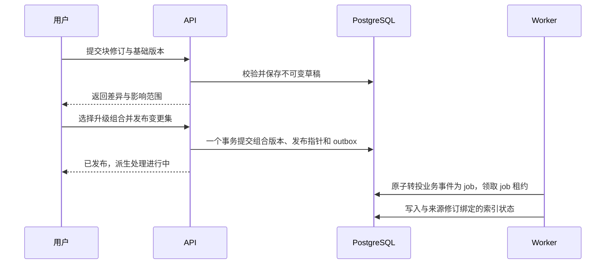

# 内容分块与存储规范

已批准设计基线 v0.3 · 2026-09-17 · 配套于[总体设计](学习系统设计方案.md)与[连续阅读与思考块设计](连续阅读与思考块设计.md)

本规范属于用户批准的系统设计；实施顺序与验收范围见[设计批准与实施路线](设计批准与实施路线.md)。设计示例将在实现时转为经过测试的正式契约。

本文定义内容的身份、粒度、存储、组合、修订和导入导出契约。以下表结构、目录和 JSON 是设计示例，不代表已经实现接口或完成数据迁移。

2026-09-30 整理入口：[当前项目架构](KnowWeave架构设计总览.md)。当前代码与验收状态以新文档及阶段台账为准，以下批准目标和格式示例不表示全部已经上线。

## 1. 核心约定

1. **内容块是最小编辑和版本单位。** 一个块修订版独立保存，不随整篇文档覆盖。
2. **稳定身份与内容修订分开。** `block_id` 回答“哪个块”，`revision_id` 回答“当时哪一版”。
3. **组合只保存引用、结构和局部展示信息。** 正式发布版必须固定引用版本。
4. **原件独立且不可变。** 抽取、翻译、讲解和批注不得冒充原文件内容。
5. **个人事实记录与内容分开。** 更新内容不会修改用户已经发生的学习活动。
6. **检索片段、预览和缓存可重建。** 不以它们的临时 ID 作为长期引用。
7. **一处编辑，多处可选择升级。** 共享关系不能造成无法察觉的全库变化。
8. **最小粒度不等于一次事务只能改一块。** 相关块可组成一个原子变更集。
9. **显示在一起，存储各有归属。** 原文与个人插入层通过固定视图版本组合；笔记、想法和猜想使用统一块正文，不复制成另一套笔记文本。
10. **关系与位置分开。** 插在一起只代表阅读顺序；支持、反对、启发等由独立关系记录表达。

## 2. 存储分区与权威来源

| 数据 | 在线权威来源 | 交换/导出形式 | 可否直接丢弃重建 |
|---|---|---|---|
| 块正文、元数据、来源和修订历史 | PostgreSQL 块/修订表 | 每个修订一个 `.json`；可附生成的 `.md` | 否 |
| 文档、单元、课程、路线结构 | PostgreSQL 组合/引用表 | 版本化 JSON manifest | 否 |
| 个人插入层、块间位置、融合阅读快照 | PostgreSQL overlay / placement / reading_view 修订 | 固定原文基线和块引用的 JSON | 否 |
| 语义关系、猜想审查与迁移决定 | PostgreSQL 关系修订与审查记录 | 带端点版本的 JSON | 否 |
| 能力、先修、规则、路线模板 | PostgreSQL 结构化表与被引用的内容块 | JSON | 否 |
| 学习日志、笔记、计划、尝试、证据 | PostgreSQL 私有记录；附件在文件存储 | 私有备份 JSON + 附件清单 | 否 |
| PDF、PPTX、源码、Notebook、媒体、实验文件 | 文件存储中的不可变对象；DB 登记元数据 | 原格式文件 + 资产 manifest | 否 |
| 初次解析、OCR、分块候选 | 处理任务结果、派生对象 | 带来源版本的 JSON/文本 | 未人工编辑时可；但不保证重跑字节一致 |
| 已人工修正或已引用的抽取结果 | 作为正式块修订与定位快照保存 | 标准块 JSON | 否 |
| 缩略图、阅读预览、搜索、向量索引 | 派生目录/索引表 | 通常不进入必要备份 | 是 |

一个“可重建”的 OCR 结果一旦承载个人修正，修正必须提升为权威内容或独立校正记录，不能继续只留在缓存中。被笔记定位依赖的文本规范化视图也须保存快照；重跑解析器不能让原有字符位置改变。

浏览器只缓存已读取内容和界面偏好。已保存状态以服务端确认的修订 ID 为准，浏览器缓存不承担唯一存储职责。

## 3. 各类文件的保存与标准化规则

| 类型 | 原件策略 | 标准层策略 | 定位方式 |
|---|---|---|---|
| 本系统手册 HTML / 自有 Markdown | 保留迁移原稿 | 提取标题结构、解释、公式、图表、代码、练习为块 | 历史文件 + 原锚点；新块与 occurrence |
| PDF | 保留原字节；改版另存 | 页/区域抽取作为候选；必要处精编为块 | 资源版本 + 物理页序号 + 可选区域/文本引用 |
| PPTX | 保留演示文稿、母版与备注 | 幻灯片、备注、图像预览；图文完整时再拆块 | 资源版本 + slide 标识/序号 + shape 定位 |
| DOCX | 保留原文档 | 段落、表格、图片、标题结构候选 | 资源版本 + 段落映射 + 文本引用 |
| `.ipynb` | 保留 cell、output、attachment、metadata | cell 引用、说明块；静态阅读副本 | 资源版本 + cell ID；旧文件用版本内映射 |
| `.py` / 其它源码 | 保留原文件；项目可保留归档与提交标识 | 符号、代码范围、说明、运行指引 | 文件资产版本 + 符号名 + 行范围/摘要 |
| 图片、音频、视频 | 保留原件或来源入口 | 图注、区域说明、字幕、转录、时间段 | 资产版本 + 区域/时间范围 |
| CSV / Parquet / 实验数据 | 保留原格式 | 字段说明、样本预览、使用与评估说明 | 数据版本 + 表/列/稳定记录键 |
| ZIP / 项目包 | 保留归档；检查后另建文件清单 | 受控解析、目录清单、项目说明 | 归档资产版本 + 已校验的成员路径 |

统一的是“身份、来源、描述、版本、引用和可维护的知识表达”，不是强迫所有文件变成 Markdown。格式转换产生阅读副本时，原件仍可下载或在其原生工具中使用。

Notebook 自身已有结构化单元，支持 cell ID 的文件优先使用其 ID；这些 ID 只在对应 Notebook 中唯一。跨 Notebook 或跨版本仍需加资源身份与版本。[Jupyter Notebook 格式说明](https://nbformat.readthedocs.io/en/latest/format_description.html)

## 4. 块类型与粒度

块采用少量稳定类型，领域特性通过标签、能力关联和经过校验的类型字段扩展。

| `kind` | 正文形式 | 边界规则 |
|---|---|---|
| `text` | 受限 Markdown 文本 | 一个完整说明/定义/推论，保留条件；标题主要属于组合结构 |
| `formula` | LaTeX、符号、条件、解释 | 公式与必需符号/适用条件一起维护 |
| `code` | 语言、源码或固定版本代码引用、说明 | 完整函数/示例或有上下文的片段；长文件用引用 |
| `figure` | 资产引用、替代文本、图注 | 图与解释一起维护，图片二进制不内嵌到块 JSON |
| `table` | 列定义、有稳定行 ID 的结构数据 | 小表整体更新；大表用数据资产引用与说明块 |
| `exercise` | 题干、要求、输入、输出、约束 | 题目独立版本；提示、答案、规则通过显式引用关联 |
| `rubric` | 条目 ID、评价条件、证据要求、判定范围 | 规则修改会创建新版本，旧验收固定旧版本 |
| `resource_ref` | 资源版本、页/区域/cell/时间选择器、说明 | 用于保留原格式阅读；不伪造尚未校验的精确位置 |
| `block_ref` | 固定块修订引用、说明及 link/card/embed 选项 | 作为引用卡时使用；普通组合复用仍可直接引用目标块 |
| `relation_view` | 关系修订列表，或个人工作区查询定义 | 正式快照冻结查询结果；不另存一套关系事实 |

`definition`、`example`、`warning` 等用文本块的语义角色表示，避免为每种标题创建新存储类型。新的顶层类型必须有类型校验器、阅读降级方式和迁移策略。

v0.3 增加与 `kind` 正交的 `intent`：knowledge、note、question、idea、conjecture、observation、evidence、conclusion。已有 `role` 限于文字表现角色，不表达证实程度。图片、代码、公式等均可承载个人笔记、观察或猜想用途。

猜想等用途可带 `semantic_payload`，按 intent 校验命题、条件、预测、验证计划引用等字段；这些字段与正文同属一个块修订。审查结果与支持/反对关系独立保存，通过固定版本关联。改变用途不会自动改变认识状态或能力验收。

### 粒度判断

- 通常从一个段落、一个完整列表、一条带条件公式、一张图表或一道题开始。
- 中文解释建议试行 100–500 字；过长提示编辑者评估拆分，但不强制切割。
- 几句话若共同表达一个不能分开的结论，可放在同一块。
- 连续多个主题、各自有独立修订理由时应拆分。
- 长推导可拆成多个推导步骤，由组合保证顺序，并显式引用前提版本。
- 公式、代码和例子若分开维护，相关引用必须明确；不依赖“见上面”这种离开页面就失效的描述。
- 列表项、表格行有局部 ID，便于批注与差异；首版版本单位仍是整个块。如确需独立复用某一行/项，则拆成新块并建立组合。

引用关系不等于把最小句子全部切散。编辑体验是连续文档，用户按需展开块边界、来源和历史。

### 三种粒度不能混淆

`Block` 是维护粒度；`LearningUnit` 是教学与任务粒度；`RetrievalChunk` 是计算粒度。一个检索片段可覆盖多个块，也可只覆盖长块的一段。检索结果必须映射回原始块修订及范围，引用展示回到稳定对象。

## 5. 标识与基础对象

| 对象 | 身份 | 要点 |
|---|---|---|
| Block | `block_id` | 随机稳定 ID，与标题、位置、正文哈希无关 |
| BlockRevision | `revision_id` + `block_id` | 不可变正文、来源、作者、父修订、模式版本与修改理由 |
| Composition | `composition_id` | 文档、章节、学习单元、课程或路线的稳定身份 |
| CompositionRevision | `composition_revision_id` | 不可变有序结构与精确版本引用 |
| Occurrence | `occurrence_id` | 一个块/子组合在某组合中的一次出现；重排保留 ID，复制出现创建新 ID |
| Resource / ResourceVersion | 逻辑资源 ID / 来源版本 ID | 逻辑课件与某次获取的明确内容分别建模 |
| Asset | `asset_id` | 原件字节、SHA-256、大小、MIME、扩展名与存储键 |
| SourceSegment | `segment_id` | 某资源版本中经确认的页/区域/cell/时间定位，保留定位版本 |
| Capability / CapabilityRevision | 能力 ID / 定义版本 | 先修边及验收目标版本化，区别于内容引用图 |
| LearningRun / PlanRevision | 学习实例 / 计划修订 | 固定起始路线版本；个人排期可独立调整 |
| ChangeSet / Release | 变更集 / 发布记录 | 相关修订、升级范围、验证结果和发布指针变更 |
| Note / Annotation | 私有笔记 / 锚点关联 | 笔记正文块独立，锚点指向内容或原件的固定版本 |
| Overlay / OverlayRevision | 个人插入层 / 层修订 | 固定原文基线与有序个人块位置 |
| Placement / GapAnchor | 出现 ID / 间隙锚点 | 完整 occurrence 路径、左右邻居与附着偏好 |
| ReadingView / ReadingViewRevision | 阅读工作区 / 融合快照 | 固定原文、个人层、关系版本与展示配置 |
| Relation / RelationRevision | 语义关系 ID / 修订 | 支持、反对、启发等，端点固定版本 |
| EpistemicReview | 认识审查 ID | 对指定猜想修订与证据快照的条件化判断 |

生产 ID 建议由服务生成 UUID。文档中的 `blk_mask`、`rev_mask_3` 等可读短 ID 只用于说明，不以数字后缀推导版本顺序。

文件哈希用于校验/去重；两个内容相同但教学角色不同的块不自动合并身份。来源、课程学期、获取时间和许可属于资源记录，即使文件字节相同也不丢失。

保留 `legacy_alias`：旧文件相对路径、c/m/r/s 编号与新身份映射。别名只定位对象，不作为今后所有对象的主键。

## 6. 标准块模型

外层字段统一，正文 `payload` 根据 `kind` 使用不同的严格结构。关系列、权限字段、引用目标建模为数据库关系；JSONB 容纳正文的类型化数据，不把可约束关系全部塞进自由 JSON。

| 字段组 | 主要字段 | 约束 |
|---|---|---|
| 格式 | `schema_version`、`kind`、`language` | 明确兼容范围；未知主版本导入时拒绝或隔离 |
| 身份 | `block_id`、`revision_id`、`parent_revision_id` | 新块父版本为空；更新必须声明基础版本 |
| 正文 | `title`、`payload` | 使用类型校验，避免不同渲染器任意解释 |
| 语义 | `intent`、`semantic_payload`、`role`、`tags`、能力关系 | 用途与形式正交，字段随修订；审查与工作流状态另存 |
| 来源 | `provenance` | 区分原创、抽取、翻译、改编；可有多个来源 |
| 上下文依赖 | `relations` | 保存 `requires_context` 等正文确定依赖；用户观点关系进入独立 Relation |
| 审计 | `created_at`、`author_id`、`change_reason` | 服务端补齐；由请求客户端提供的作者不直接可信 |
| 完整性 | 内容摘要值、计算配置版本 | 服务端计算，不以客户端声明代替校验 |

示例：原创工程说明块的一个修订。只展示交换所需主要字段，哈希等服务端字段由导出器补齐。

```json
{
  "schema_version": "1.0",
  "block_id": "blk_mask",
  "revision_id": "rev_mask_3",
  "parent_revision_id": "rev_mask_2",
  "kind": "text",
  "intent": "knowledge",
  "role": "warning",
  "language": "zh-CN",
  "title": "核对布尔 mask 的接口语义",
  "payload": {
    "format": "markdown",
    "text": "调用注意力接口前，先核对该接口对布尔 mask 的约定，并用小型输入验证被屏蔽的位置。"
  },
  "tags": ["attention", "correctness"],
  "provenance": {
    "origin": "authored",
    "sources": [],
    "transformation": "none"
  },
  "relations": [
    {
      "type": "requires_context",
      "target_block_id": "blk_causal_rule",
      "target_revision_id": "rev_causal_rule_2"
    }
  ],
  "change_reason": "明确要求按实际调用接口核对约定并验证",
  "author_id": "owner_demo",
  "created_at": "2026-09-17T08:00:00Z"
}
```

Markdown 是正文中的一种文本表达，不是应用组件代码。首版禁用任意 HTML、脚本和可执行 MDX；公式由受控数学渲染器处理。结构表格与练习等继续使用类型化字段，避免靠 Markdown 文本解析判定业务状态。

文本中的内部链接和外层 `relations` 都须被导入校验器识别并建立依赖索引。正式发布时，每个内部引用都能解析到确定版本；不允许隐藏在正文里的“永远追最新版”绕过发布规则。

对可重用的导出格式，使用版本化 JSON Schema 描述字段。`schema_version` 与内容修订、领域包版本、原件版本是不同概念。导出 JSON 的规范序列化规则由格式版本定义：对象键稳定排序、数组顺序保留、代码和公式字符串不做隐式改写；内容摘要用于检测变化，不作为对象身份。

本系列文档 v0.3 是设计版本，示例中的交换格式 1.0 尚未正式发布；当前字段变更不会被声称为对已运行系统执行的模式迁移。正式实现前需将定稿字段编入统一 Schema。

## 7. 原件、来源定位与可信度

`Resource` 表示一份逻辑讲义；`ResourceVersion` 表示某次明确内容及来源元数据；`Asset` 表示不可变文件字节。资源版本也可只有在线入口、没有本地资产，必须展示访问状态。

抽取块的来源至少包括：

| 字段 | 用途 |
|---|---|
| resource_id / resource_version_id / asset_id | 识别逻辑资料与固定原件 |
| original_url / fetched_at | 追踪来源与获取时间 |
| course_edition / cover_date / published_at | 分别记录课程学期、封面日期、已知发布时间，不相互替代 |
| selector | 原件中位置：页、区域、cell、代码或时间 |
| extraction_run_id / processor_version | 解释该文本如何得到 |
| origin / transformation | 抽取、OCR、翻译、归纳、原创等分别标记 |
| review_status | 未核对、已核对、定位存疑；放在审查记录中 |
| rights / attribution | 保存原有许可和署名信息，未知则标未知 |

PDF 的 `page_index` 在数据中从 0 开始；界面显示第 1 页起的物理页序号。印刷页码单独保存为 `page_label`。区域坐标以已考虑旋转的显示页为基准，左上原点、0–1 归一化，并登记坐标规范版本。没有核对就仅链接整份资料，不能推测页码。

例：一个**虚构示例资源**的定位对象，数值只说明格式，不对应现有课件的真实页码。

```json
{
  "resource_id": "res_demo",
  "resource_version_id": "resver_demo_1",
  "asset_id": "asset_demo_pdf",
  "selector": {
    "type": "pdf_region",
    "page_index": 11,
    "page_label": "10",
    "coordinate_profile": "display-page-top-left-normalized-v1",
    "rect": [0.12, 0.18, 0.76, 0.35]
  },
  "review_status": "unreviewed"
}
```

`rect` 明确为 `[x, y, width, height]`，不是两个角点。审查状态枚举为 `unreviewed / verified / uncertain`；上例 `unreviewed` 表示尚未核对。这是格式示例，不能导入为当前课件的已确认位置。

课程下载件不经用户编辑覆盖。需要修正讲义解释时建立“针对原件的校正/说明块”；需要改编代码时创建派生文件和关联关系。来源抽取有错误时修订标准块，原件哈希保持不变。

## 8. 组合、依赖与发布快照

文档、章节、单元、课程、路线都是组合，但有各自的业务字段。例如学习单元另外定义目标能力、估计投入、练习和验收；课程另外登记学校、课程号与学期。

组合结构和正文分开存储。章节可以成为子组合；改某章只生成该章及祖先清单的新版本，其他章节继续引用原修订。首版无需为所有层次都制造一份完整正文副本。

示例：只摘出一个文档修订的组合字段。

```json
{
  "schema_version": "1.0",
  "composition_id": "doc_attention",
  "composition_revision_id": "docrev_attention_8",
  "kind": "document",
  "title": "Attention 工程说明",
  "nodes": [
    {
      "occurrence_id": "occ_rule",
      "type": "block_ref",
      "block_id": "blk_causal_rule",
      "revision_id": "rev_causal_rule_2"
    },
    {
      "occurrence_id": "occ_mask",
      "type": "block_ref",
      "block_id": "blk_mask",
      "revision_id": "rev_mask_3"
    }
  ]
}
```

### 引用模式

- 已发布组合只能固定版本；嵌套组合也固定，整个依赖闭包可复现。
- 草稿可显示“有更新”，临时比较最新修订；发布前必须解析为确定版本。
- “订阅更新”默认生成升级候选，不直接改写已发布组合。以后开放自动接纳时，也必须创建新的发布记录。
- 同一块可以在一个组合出现多次，每处有独立 occurrence ID；重排不改变其身份。
- 相同内容可被跨域引用。希望改出另一种表述时派生新块，保留 `derived_from` 关系；仅当前文档的提示用附加块。

### 引用图与依赖范围

分别维护组合/位置、正文依赖、来源谱系、用户思考关系和能力先修。组合嵌套必须无环；`requires_context` 在发布闭包中必须可满足且避免递归展开；用户思考关系允许成环，但不参与无限自动展开；能力硬先修必须无环。反向链接和关系面板汇总这些来源，不另建一套可独立修改的重复关系。

发布校验检查块类型、对象存在、精确修订、权限/可分享范围、上下文完整性、环、资源状态和题目/规则关联。只登记入口的网络资源可以明确标为 external-only；被声明“本地可用”的资产必须已经验证存在。

反向引用索引能列出受影响文档、学习单元、路线和直接关联笔记。影响分析区分“必然受引用变化影响”和“语义上建议复查”，后者不能假装已自动证明。

### 个人插入层与融合阅读

个人插入层固定原文基线，以 Placement 引用独立个人块；GapAnchor 保存完整 occurrence 路径、左右原文邻居及 after_left/before_right 偏好。同一间隙的个人块按组排序。空文档、文首文尾和连续个人块间均有明确插入位置。

个人保存以事务生成块/层/视图修订并推进当前工作头，无需每次手动发布原文。跨设备以服务端已确认工作头为准；导出、审查和学习引用固定 ReadingViewRevision。原文升级时生成位置迁移记录，不确定项保留在待放置列表。详见[连续阅读与思考块设计](连续阅读与思考块设计.md)。

## 9. 块级更新协议

### 9.1 编辑与冲突

修订正文一旦保存便不可变。继续编辑产生新的草稿修订；“当前草稿”“当前发布”的指针和审查状态是独立的可变工作流记录，不原地修改修订正文。

客户端提交目标块、基础修订、修改内容和请求幂等键。服务端使用乐观并发控制：基础修订与当前编辑头不一致时返回冲突和双方差异，用户可合并或另存派生块。不同块的编辑无需互相覆盖。

同一幂等键与同一请求内容重试返回原结果；同键不同内容拒绝。请求已提交但响应丢失时，客户端查询结果，不生成重复修订。个人使用仍有两个设备或两个标签页的并发，因此首版就需要这一约定。

### 9.2 原子发布



发布前固定本变更集依赖；提交时再校验编辑头和预期组合发布指针，防止预览之后他处修改导致丢失更新。公式、示例、题目和规则可一起提交，事务失败则对外均不生效。

数据库发布与搜索构建不是一个跨系统事务。发布成功意味着权威内容和引用已经一致；索引尚未完成时必须显示真实状态。上图是完整目标流程，HTTP 和索引处理器尚未实现。截至 C2，旧 `outbox_event` 仅保留 `composition_released`；v3 Figure/Attachment 的精确块资产使用在同一业务事务写入独立 `job_outbox`，再原子转投为 `job`，由 Worker 领取租约。仅登记资产或仅关联资源版本不自动入队；不能将旧发布事件表直接当作当前作业队列。

### 9.3 增量范围

| 变化 | 需要新增/重算 | 可复用 |
|---|---|---|
| 改一个解释块 | 新块修订、采用它的组合修订、相关检索片段与预览 | 原件、其它块和不升级的组合 |
| 移动章节顺序 | 组合结构、导航、依赖上下文的派生片段 | 块正文与原件 |
| 仅改标签或来源描述 | 元数据修订、筛选索引、必要引用显示 | 正文向量可按实际输入摘要复用 |
| 换一张图 | 新资产、图块修订、受影响预览/索引 | 无关图片、文本和课程 |
| 原 PDF 更新 | 完整新 PDF 资产、版本对齐、变化页的处理候选 | 经验证相同的派生内容；原版保持可读 |
| 检索切分/模型版本改变 | 新派生索引代次 | 所有权威内容与引用 |
| 原文间插入或移动个人块 | 个人层/视图修订、位置与相应派生视图 | 原文组合、没有修改的块正文与资产 |
| 改一条 supports/opposes 关系 | 关系修订、相关关系视图与待复核提示 | 两端块正文与旧审查记录 |

派生任务键包括输入修订集合、处理器版本、配置摘要。检索片段若含上下文或邻居块，也要登记这些依赖；不能只检查中心块便漏掉上下文变化。

按影响依赖集合做失效与重算，首版允许重新生成受影响整份小文档的 HTML 预览；“块级更新”不意味着任何格式的物理文件都支持字节级补丁。

### 9.4 索引一致性与回滚

索引记录绑定块修订与可见发布版。新组合可复用未变块的索引，只为变化部分补建。查询必须按当前选择的发布快照和权限过滤；旧索引中的旧内容不能冒充新版。

索引未就绪时继续显示正文、标题与可用的结构查询；全文结果标明覆盖状态或等待新代次，不能悄悄返回过期片段。全文检索回退也必须使用正确版本。

回滚通过追加一条发布操作，将活动指针切到一个已验证的旧发布版，或者以旧内容生成修订后再发布。保留发布历史和期间学习事实；由所选发布版控制索引可见性。内容回滚不删除这段时间的新笔记、任务尝试或其它用户数据。

## 10. 拆分、合并、删除与笔记锚点

### 拆分与合并

旧块拆成多个不同语义块时创建新 ID，记录 `split_from` 与旧范围到新块的映射；多个块合并时创建新 ID 并记录 `merged_from`。不能仅换标题就把旧 ID 改造成不相关概念。

“删除”默认是从新组合中移除或停用对象。仍被历史发布、笔记、证据或备份引用的版本不进行物理删除。首版只清理已过保留期的未引用临时上传和可重建缓存；历史内容永久清理留待有明确保留规则的管理流程。

### 注释关联

锚点至少包括固定修订和目标范围，可选组合修订及 occurrence ID，以区分“这个概念的一般笔记”和“在这篇文档这一处的批注”。注释正文属于私有笔记，不写进共享内容块。

Annotation 表示对内容范围的批注，Placement 表示在页面间隙的插入，两者可分别存在并引用同一笔记块。Note 只保存归档、集合等元信息，正文统一存 BlockRevision，不能再维护 note.body。知识块与个人块各有权限归属，连续显示不合并它们的权威来源。

文本选择同时保存短引文、前后文和字符位置；另存文本规范化视图版本。字符位置按 Unicode code point 计数，不能直接当成 JavaScript UTF-16 下标。原件注释则保留资源版本及页/区域/cell 等定位。

短引文和前后文可参照 W3C 的 Text Quote Selector；字符位置必须绑定明确文本版本，因为文本变化会使纯位置定位变得脆弱。[W3C Web Annotation Data Model](https://www.w3.org/TR/annotation-model/#selectors)

升级后的注释关联有三种结果：唯一精确匹配、可疑候选、无匹配。精确匹配也保存迁移记录与原锚点；候选需要用户选择；无匹配进入待关联列表。不存在“为了看起来全部成功而把批注贴到最近一段”的策略。

能力验收固定题目、规则、产物和环境版本。块文字修订并不一律要求重新学习；只有目标、约束或验收含义变化时提出具体补验建议，原通过事实仍保留。

## 11. 原件写入与数据库的一致性

文件存储和 PostgreSQL 不共用事务，使用“先完成不可变文件，再提交引用”的协议：

1. 登记 upload ID，流式写入临时对象，检查大小与类型，计算字节 SHA-256。
2. 完成原件写入，读取元信息核对；文件目录后端用同一文件系统内原子重命名，S3 后端等待写入完成并核对必要元信息。
3. 在数据库事务中登记 Asset / ResourceVersion，只有已验证资产才可作为本地就绪引用。
4. 同步写入后台处理任务。解析失败不撤销已经正确保存的原件，状态显示失败原因与重试入口。
5. 对“文件已写、数据库未提交”的孤立对象做延迟对账；确认没有活动上传、引用和备份保护后再回收。

Asset 的业务 ID 与存储键分离。相同字节在当前私有库内可去重；权限属于资源/资产记录，不能因用户知道某个 SHA-256 就允许下载。存储键由服务生成，不由导入包中的任意路径决定。

PDF 新版本通常需要保存一个新完整对象。S3 自带版本控制能辅助恢复误覆盖，但每个版本仍是完整对象；业务块历史和组合版本仍由本系统管理。S3 兼容实现的特性需在选型时验证，不能直接假定与 Amazon S3 全部一致。[Amazon S3 Versioning 文档](https://docs.aws.amazon.com/AmazonS3/latest/userguide/Versioning.html)

## 12. 数据表与查询边界

逻辑表建议如下，实际 DDL 在实现阶段确定。

| 模块 | 核心表组 | 重要约束 |
|---|---|---|
| 身份 | user、workspace | 首版一个私有 workspace，所有私有对象带归属 |
| 资料 | course、course_edition、resource、resource_version、asset、source_segment | 原件哈希、版本归属、来源定位、状态明确 |
| 内容 | block、block_revision、block_dependency、review_record | 修订不可变，形式/用途校验，父修订属于同块，依赖与正文同事务 |
| 组合 | composition、composition_revision、composition_node、release、change_set | occurrence 唯一性、顺序、引用闭包、发布并发校验 |
| 个人阅读 | overlay、overlay_revision、placement、reading_view_revision、placement_migration | 原文基线、完整位置路径、并发顺序、融合快照可复现 |
| 思考关系 | relation、relation_revision、epistemic_review | 端点和证据固定版本、方向明确、AI 候选与人工接纳区分 |
| 学习定义 | domain_pack、capability_revision、prerequisite、unit_spec、rubric 引用 | 硬先修无环，固定规则版本 |
| 个人记录 | learning_run、plan_revision、task、session、attempt、artifact、evidence、assessment | 属主检查，事实记录与计划分开，修正可追踪 |
| 笔记与复习 | note、annotation、anchor_migration、review_schedule、review_result | 固定目标版本，迁移不丢原锚点 |
| 后台 | outbox、job、derived_artifact、search_entry | 幂等键、租约、输入版本与状态 |
| 可移植性 | import_run、export_run、backup_manifest、legacy_alias | 重试可恢复，冲突可报告，导出可核验 |

用于业务约束的 ID/归属/外键为列；适合查询的类型、时间、状态做索引。JSONB 承载类型化正文，不意味着接受任意字段的无模式数据库。

### 建议接口边界

接口版本独立于内容版本，客户端不直接操作数据库或服务器文件路径。以下是行为契约示意：

| 操作 | 输入重点 | 结果 |
|---|---|---|
| 获取内容修订 | 块 ID + 修订 ID | 原文、来源、关联与权限过滤后的元信息 |
| 创建修订 | 基础修订 + 正文 + 幂等键 | 新草稿修订或冲突结果 |
| 查询影响 | 变更集 + 目标组合 | 确定引用变化及建议复查项 |
| 发布 | 变更集 + 预期发布指针 | 新发布记录与派生状态 |
| 保存批注 | 内容/原件固定版本 + 锚点 + 私有正文 | 服务端保存版本和待迁移状态 |
| 在间隙插入块 | 基础个人层修订 + GapAnchor + 块修订 + 幂等键 | 新位置及融合视图修订，或冲突差异 |
| 建立/修订关系 | 两端固定版本 + 类型 + 理由 + 基础关系修订 | 独立关系修订与审查记录 |
| 读取融合视图 | 原文版本 + 个人层/视图修订 + 过滤条件 | 权限过滤后的有序内容与来源标识 |
| 下载原件 | 资产 ID | 经鉴权的流式响应或短期访问链接 |
| 导入包 | 模式版本 + manifest + 资产 | 预检报告，再提交导入批次 |
| 导出包 | 范围 + 发布版 + 是否含个人数据/原件 | 固定快照清单和文件校验值 |

首版同一块写入冲突交给显式合并，不引入实时协同 CRDT；离线编辑同步也不是这些接口当前承诺的行为。

## 13. 文件目录与交换包

以下目录描述**导出包**；在线服务不是每写一个块就直接改这个目录。块修订的数据库记录可独立更新；导出时可按块生成文件，便于审查、迁移和复用。

```text
learning-package/
  manifest.json                   # 包格式、包 ID、发布版、模式依赖、校验清单
  domains/                        # 领域与能力定义
  blocks/<block-id>/<rev-id>.json  # 每个不可变块修订一个文件
  compositions/<id>/<rev>.json    # 文档/章节/单元/课程/路线清单
  resources/                      # 来源、版本、片段定位、许可、旧别名
  assets/sha256/<prefix>/<hash>    # 按需携带原件；名称与扩展名见 manifest
  personal/                       # 完整备份或明确选择个人内容的导出包含
    overlays/                     # 个人插入层与 placement
    reading-views/                # 固定原文、个人层和关系的融合快照
    relations/                    # 个人关系与认识审查
  views/                          # 可选生成的 Markdown / HTML 阅读视图
  reports/                        # 导出缺失项与验证报告
```

每个 JSON 文件包含完整该修订内容，不只保存相对于某未知版本的 diff。这样单个块可直接读取与校验，数据库外也不依赖一条漫长补丁链。很小的块可在传输时打包压缩，更新身份不因此变成整包身份。

### 导出种类

- **领域模板包：**能力、块、组合、练习/规则和来源；默认无个人笔记和学习历史，原件按许可及选择打包。
- **个人完整备份：**所有权威版本、记录、清单及必要原件；密钥独立保存，不混入普通内容包。
- **融合学习快照：**显式选择个人内容，携带原文基线、个人层、块/关系/位置版本与必要资产；模板包默认仍排除这些个人数据。
- **阅读快照：**生成 HTML / Markdown，可附相对路径原件；记录快照时间与发布版，无服务器编辑能力。
- **增量包：**声明基线发布版、新增修订、组合变化、资产校验值和停用记录；导入方必须先满足基线和全部依赖，不能把缺失项静默忽略。

用户修改导出的 JSON 或 Markdown 后，要重新通过导入预检和修订流程进入系统；不能在文件和数据库之间实时互相覆盖。Markdown 再导入可能不能无损恢复所有类型字段，因此标准 JSON 是完整交换格式。

导入时校验包格式、重复 ID、未知主版本、内容/权限范围、引用闭包、循环、资产摘要和路径。已有相同 ID/修订且内容一致则复用；同 ID/修订但内容不同必须拒绝；派生内容创建新 ID 并保留上游关系。先暂存、再发布可见导入批次，失败不留下半可用路线。

## 14. 验证场景与实施优先级

这些是未来实现的验收合同，当前只完成设计。

| 场景 | 必须成立 |
|---|---|
| 同块在两文档出现 | 共享身份、可分别选择升级；不复制正文制造分叉 |
| 同文档重复引用同块 | occurrence 不同，局部批注不会混在一起 |
| 同标题不同内容 | ID 不冲突；改标题不改变链接 |
| 同字节不同课程来源 | 文件可去重，来源与学期信息各自保留 |
| 改一个块 | 新建该块修订；只更新受影响组合与派生依赖 |
| 多块原子发布失败 | 外部仍看到旧的完整发布版 |
| 两设备从同基础版本提交 | 第二次冲突有差异，不覆盖第一次 |
| Worker 超时或重复领取 | 重试后结果等价，不重复发布；可查询失败原因 |
| 旧 PDF 新排版 | 旧定位不变，新定位有审查状态 |
| 块拆分/合并 | 旧 ID 可打开、后继可查、注释可人工重挂 |
| 重建 OCR 或索引 | 人工校正与已保存锚点仍存在，不随缓存清空丢失 |
| 回滚内容发布 | 内容恢复，期间新学习事实不被清除 |
| 领域包往返导入导出 | 依赖完整，ID/修订/资产哈希一致，私有记录不混入模板 |
| 原文和个人块混排 | 外观有身份标签，正文独立，切换视图不丢内容 |
| 原文邻居删除/拆分 | 插入内容仍可查，不确定位置可人工重放 |
| 猜想与证据关系升级 | 关系端点不漂移，旧审查保留，新版本需复核 |

首个纵向样例使用 Attention：一个固定讲义原件、数个内容块、两份复用同块的组合、一个学习单元、一条私有批注、一份验收证据。让它经过一次修订、一次冲突、一次拆分和一次导出恢复，再扩展到整套课程库。
