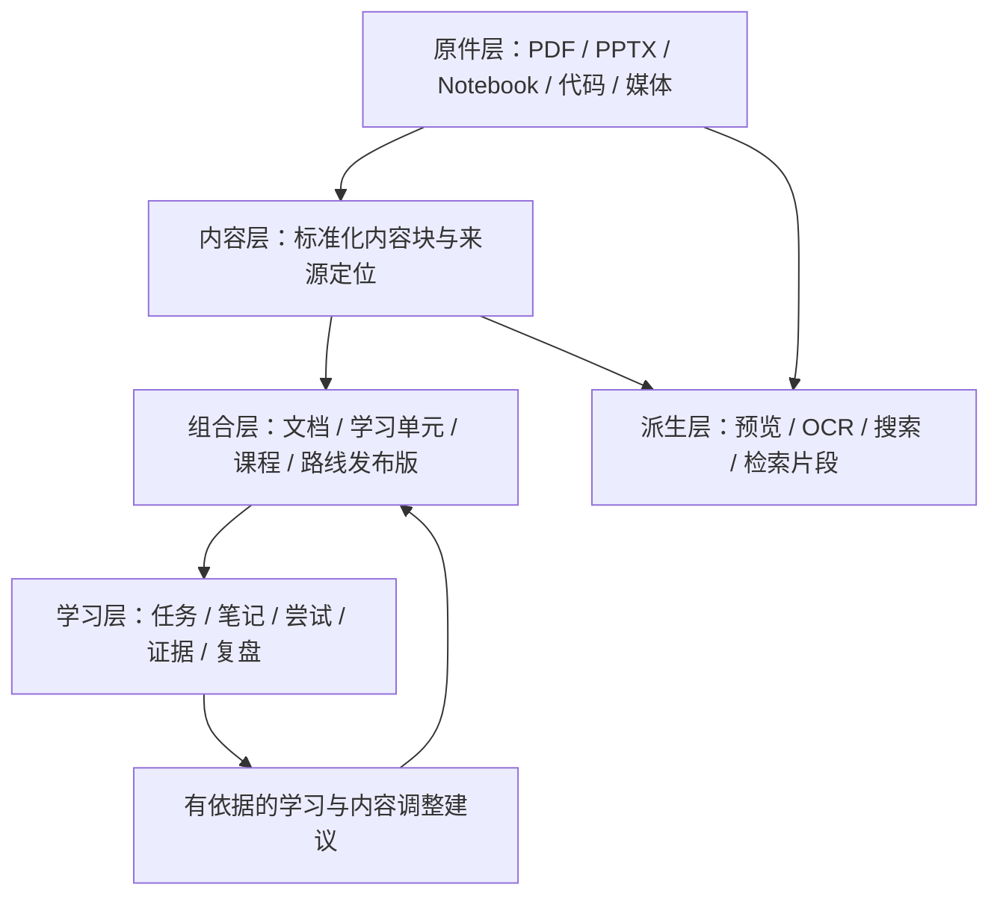
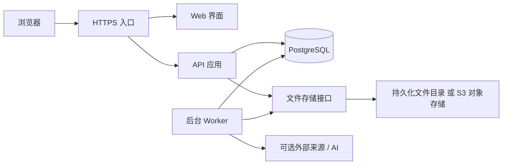

# 可进化、可复用的个人学习系统

已批准设计基线 v0.3 · 2026-09-17 · 连续阅读、个人插入层与思考关系版 · 实施状态更新至 2026-09-24

用户已确认“系统设计方案通过”。批准范围、分阶段交付与验收映射见[设计批准与实施路线](设计批准与实施路线.md)。

2026-09-30 现状：P0-A、P0-B1–B4、P0-C1–C3 内核已各自隔离验收；C4 完整备份恢复实施中，只读子进程绑定专项已通过，实际恢复与整关未验收。P1 登录/API/Web 与学习闭环待建设。本文保留批准目标，最新分层事实见[架构设计文档入口](KnowWeave架构设计总览.md)及[实施路线与架构图](../KnowWeave实施路线与架构.html)。

本版采用 **服务器上的个人学习工作空间 + 可组合内容块 + 独立原件库**。知识、笔记、图片、问题、想法和猜想可以连续阅读、随处插入，并以用途和来源区分外观。内容块是最小维护单位；学习单元组织任务；文档与路线通过引用组合。个人插入层、关系、进度和证据分别留存版本。

设计拆为四份，本轮新增重点在第二份：

- 本文件：产品边界、总体结构、学习流程、建设顺序。
- [连续阅读与思考块设计](连续阅读与思考块设计.md)：融合阅读、任意间隙插入、想法与猜想、块链接、块关系和演进过程。
- [内容分块与存储规范](内容分块与存储规范.md)：内容类型、粒度、存储格式、组合引用、增量更新与版本规则。
- [服务器部署与数据恢复设计](服务器部署与数据恢复设计.md)：应用拆分、运行目录、部署边界、后台处理、备份与恢复。

上一版 v0.1（私有或未公开参考） 仅保留为历史；其中“本地应用优先、SQLite 主存储、跨设备作为后续扩展”的建议由本版替代。Rust 内容内核、原件存储和 Worker 已实现并隔离验收，完整浏览器学习应用尚未完成或生产部署；课程库尚未批量导入。下述数据库隔离实验属于早期选型验证，其历史结论保持不变。

v0.2 存储架构草案（私有或未公开参考） 也已归档。v0.3 保留其服务器和版本基础，新增统一块用途、独立个人编排及可维护的思考关系；没有把笔记混入原课件或改变来源归属。

数据库隔离实验已完成查询与性能测量，来源任务复核了 33,600 条正式样本。依据[数据库选型实验审阅与首版决策](数据库选型实验审阅与首版决策.md)，**首版采用 PostgreSQL 处理权威数据和关系查询，暂不常驻 Neo4j**；保留可重建图投影的接入契约。该结论限于当前两组场景及中样分布，完整生产权限、发布和并发写入仍需实现与验证。[测前验证方案](PostgreSQL与Neo4j对比验证方案.md)保留实验合同与未来重评条件。

早期实验完整合同状态仍为 `NOT_PASSED`：当时补充检查发现两种原型共 4 项隐藏引用/正文权限失败，实验代码不能直接上线。后续 Rust 内核已按正式权限与必要引用闭包契约实现并完成对应阶段回归，具体范围见当前验收记录；内核通过不改写原实验结论，HTTP、导出和完整恢复仍需在各自阶段另验。

## 1. 已确定的产品方向

服务个人长期学习，可复用于深度学习、系统工程、数学等领域。首个领域是深度学习与大模型工程，学习者已有实践经验，每周投入 10–15 小时。

新增约束：可部署到服务器，通过浏览器跨设备访问；程序、数据、原始资料、派生缓存分开；适合结构化的内容统一格式，需保真或继续编辑的文件保留原格式；以小块为最小内容更新单位。

本轮补充：阅读与个人思考在同一内容流展示；支持在两块之间、文首和文尾插入笔记、图片或其它块；支持猜想、想法、块引用，以及支持、反对、启发等有明确含义的关系。

首版默认单人私有实例。账号与身份验证从首版具备，跨设备通过同一服务读写；组织管理、多人实时共同编辑和离线双向同步不进入首版。核心学习不依赖 AI，但使用在线系统需要能连接服务器；离线阅读通过导出快照提供。

成功标准：能回答“现在学什么、为什么、怎样算通过”；改一个知识点能明确影响哪些材料；换目标、换设备或更新内容后，旧记录仍可查，已积累的知识仍可复用。

## 2. 架构选择与取舍

| 方案 | 优点 | 主要代价 | 选择 |
|---|---|---|---|
| 文件站点：Markdown + 原件目录 + 静态生成 | 易阅读、可用 Git 管理、托管简单 | 细粒度引用、跨设备写入、事务、个人学习记录需要另做系统 | 保留为导出与交换能力 |
| **服务端应用：关系数据库 + 内容块 + 文件存储** | 块级更新、版本关联、可靠学习记录与多设备访问自然统一 | 需要服务、数据库和备份运维 | **推荐主方案** |
| 通用 CMS / 知识库平台深度改造 | 初期可复用编辑器与资料管理 | 学习证据、路线版本和块级来源模型可能受平台限制 | 后续选型时对照评估，核心模型独立 |

推荐采用模块化单体：一个应用代码库、清晰业务模块、API 与后台 Worker 分进程。首版在单台服务器部署，无需先建设微服务、Kubernetes 或独立向量数据库。

这里“拆分文件”有三个层次：应用代码按职责拆分；运行数据按寿命和用途拆分；文档正文按语义块拆分。不能只把一个大 HTML 改成多个页面，就认为具备了块级复用和更新。

## 3. 五层数据结构



| 层 | 保存什么 | 主存储和格式 | 更新方式 |
|---|---|---|---|
| 原件层 | 下载的课件、代码、Notebook、图片、实验产物 | 独立文件存储，保留原字节及扩展名；数据库登记身份与 SHA-256 | 文件内容变更产生新资产，不覆盖旧件 |
| 内容层 | 知识、笔记、想法、猜想等的文本、公式、图像、代码、练习与规则 | PostgreSQL：固定元数据列 + 有类型的 JSONB 正文；按归属隔离 | 一个语义块产生一个新修订版 |
| 组合层 | 文档、单元、课程、路线，以及个人插入层与融合阅读快照 | 有序引用、间隙位置和固定版本清单 | 顺序、位置或采用版本变化产生新修订 |
| 学习与思考层 | 会话、计划、验收、复习、批注锚点、块关系、猜想审查 | 独立记录 + 引用统一内容块；不重复存储笔记正文 | 保留事实、关系修订和判断条件 |
| 派生层 | 文本抽取、OCR、缩略图、网页预览、搜索索引、AI 检索片段 | 可重建缓存、索引表或对象；带来源版本与处理器版本 | 只重建受变化影响的派生结果 |

**数据库是在线结构化内容的权威来源；JSON/Markdown 文件是导入导出格式；原件库是原始字节的权威来源。** 不维护数据库与文件夹两个同时可随意修改的正文主副本。

选择 JSONB 是为了结构可校验、可查询，块身份和引用仍用关系约束管理。PostgreSQL 官方文档说明 JSONB 可索引，也提醒大 JSON 更新涉及整行锁；因此一个块版本单独一行，避免整本书挤在一个 JSON 字段。[PostgreSQL JSON 类型文档](https://www.postgresql.org/docs/current/datatype-json.html)

## 4. 内容块、文档与学习单元的关系

### 4.1 内容块：最小可独立维护的语义内容

例如“一段带条件的定义”“一条公式及符号说明”“一个完整代码示例”“一道练习题”。默认优先按段落、列表、图文、公式、代码、题目等自然边界拆分，保留必要上下文。

粒度以能独立解释、引用和修订为准。普通解释可先试行 100–500 个中文字符；这是编辑提示，不是硬上限。公式不能拆掉适用条件，证明可拆步骤但需声明前提，代码不按固定行数机械切断，表格先保持整体结构。

三种不同单位必须明确：

| 单位 | 用途 | 示例 |
|---|---|---|
| 内容块 Block | 编辑、复用、引用、版本更新 | Causal Attention 的屏蔽规则 |
| 学习单元 LearningUnit | 目标、任务、资源、验收，通常一次或数次学习会话推进 | 60 分钟实现并检查因果注意力 |
| 检索片段 RetrievalChunk | 适配搜索或模型上下文，可自动重切 | 将相关说明与公式合并后检索 |

检索片段属于派生数据，不能充当用户笔记和长期引用的唯一身份。学习单元也不能等同于一个知识块，否则内容仍然过粗。

### 4.2 组合：引用块，不复制正文

```text
深度学习领域包
  └─ 大模型工程路线 v1
       └─ Transformer 阶段
            └─ 学习单元：实现 Causal Attention
                 ├─ 内容块：为什么需要因果限制 @修订3
                 ├─ 内容块：公式、条件与符号 @修订2
                 ├─ 内容块：实现示例 @修订4
                 ├─ 内容块：边界练习 @修订1
                 ├─ 内容块：验收规则 @修订2
                 └─ 原件片段：某讲义特定版本的已核对页码
```

“Attention 工程参考文档”可以引用同一公式块和实现块；“多模态领域包”也可以引用。组合中的每一次出现有独立 occurrence ID，便于保存“这篇文档中的这一处”书签和局部注解。

复用方式明确区分：引用同一块、基于某版派生新块、附加本处注释。编辑共享块前显示影响范围；只想修改当前文档的表达时，应派生新块，不能静默改变所有复用者。

### 4.3 两类版本同时存在

**块修订版**回答“这段内容写了什么”；**组合发布版**回答“这份文档或路线当时使用哪些块版本、以什么顺序呈现”。正式发布版固定依赖版本，打开旧记录时可复现原文。

更新共享块会生成升级候选。选择让哪些文档采用新修订版后，发布新的组合版本。正在进行的学习实例保留起始版本，可预览差异后升级；历史证据不跟随最新版静默漂移。

### 4.4 连续阅读与个人插入层

默认页面将原文和个人内容连在一起，原文采用中性正文样式，笔记用轻量侧线，想法与猜想有用途和状态标签。图片沿用其所属用途的外观；区分不只依赖颜色。可以切换为只看原文、我的思考或当前块的关系。

```text
原文 A
  我的笔记 N
  我的图片 I
  猜想 H（待验证）
原文 B
  引用另一篇文章的块 R
原文 C
```

个人块通过独立插入层定位到原文间隙，不改写原文。位置使用原文版本、完整 occurrence 路径、左右邻居与附着偏好；正文改变与位置移动是两种独立操作。原文升级时先保留旧基线，确定映射可迁移，不确定项进入待重新放置列表。

自己的文档另提供明确的“编辑原文”模式；跨文章重组时可创建个人专题组合。日常个人块自动保存，导出或引用学习快照时固定原文、个人层、块及关系版本。

### 4.5 块形式、用途和关系

内容形式 `kind` 表示文本、公式、图片、代码、引用卡等；用途 `intent` 表示知识、笔记、问题、想法、猜想、观察、证据、结论。来源、可见范围和认识状态分别保存，因此“猜想图片”“观察代码片段”等也能使用同一套模型。

块链接提供跳转与预览；块引用让同一内容在另一处呈现；块关系表达为什么相关，例如“证据支持猜想”“反例反对判断”“想法受某块启发”。关系独立版本化并绑定具体端点修订，猜想变化会提示复核关系。

想法可以发展为可检验猜想，接着关联实验、观察与支持/反对证据，形成带适用条件的结论。各阶段保留历史；支持关系或用途标签不会自动将猜想变成已证实知识。详见[连续阅读与思考块设计](连续阅读与思考块设计.md)。

## 5. 原格式与统一格式如何配合

| 材料 | 保留原格式 | 统一出的内容 | 默认处理策略 |
|---|---|---|---|
| 本系统编写的手册、知识解释 | 原 HTML 作为迁移归档 | 文本、公式、图表、代码、练习等块 | 精确拆块，后续按块维护；HTML 为生成的阅读视图 |
| PDF / PPTX / DOCX | 保留完整原件 | 来源、页/幻灯片定位、已抽取文本与必要的精编块 | 先可读和可定位，再按实际学习需要精编 |
| Notebook | 保留 `.ipynb`、单元、输出与元数据 | 单元定位、说明块、代码引用 | 阅读视图可重建，不自动执行；原件不降格成纯 Markdown |
| 代码项目 | 保留原文件或有版本的项目快照 | 文件/符号/代码段定位、解释、运行指引 | 代码副本必须有来源和版本，不把截图当源码 |
| 视频 / 音频 / 图片 | 保留原件或仅登记原站链接 | 时间范围、图注、转录、概念索引 | 不因引入系统就要求整段转码或本地下载 |
| 个人笔记 | 统一块结构，保留私有属性 | 与内容、任务和证据的关联 | 笔记与所批注正文分开更新 |
| 学习日志 / 计划 / 验收 | 结构化记录 | 固定字段、枚举、引用 | JSON 可移植导出，不以自由文本替代关键状态 |

**原件保真、结构化层可编辑、派生层可重建。** 改一段知识解释可以只更新一个块；更新教师发布的 PDF 时，要保留新的完整 PDF 文件，再比较可提取部分。原件是否重用取决于字节内容是否相同，不能承诺任意 PDF 都能按段落物理更新。

Notebook 采用其既有文件结构；支持 cell ID 的版本优先使用原 cell ID 定位，旧文件使用版本内生成的映射，映射不写回原件。[Jupyter Notebook 格式说明](https://nbformat.readthedocs.io/en/latest/format_description.html)

## 6. 一个块更新时实际发生什么

示例：修正“Attention mask 中 True 的含义依赖具体 API”这条工程说明。

1. 在原块上创建新修订版，保留旧修订版与修改理由。
2. 展示文本差异，以及引用它的文档、单元、路线、笔记和相关验收标准。
3. 若关联代码和题目也要改，将多个块放入同一个变更集，一起校验与发布。
4. 选择采用新版的组合，创建新发布版；未选择的组合继续引用旧版。
5. 在数据库事务中提交版本关系和后台任务，页面可立即读取已发布正文。
6. 后台只重建受影响的预览、检索片段和索引；其他块及原件保持复用。
7. 原笔记继续指向原版；提供迁移候选。原验收保持事实记录，必要时另列“需要补验”的事项。

最小编辑单位可以很小，但一次发布允许包含多个相关块，防止公式改了、示例与验收还停留在不兼容版本。

内容块拆分或合并时保留前后继映射，不复用旧 ID 冒充新内容。新版定位不确定的注释进入待关联列表，旧版始终可打开。完整规则见[内容分块与存储规范](内容分块与存储规范.md)。

## 7. 学习系统仍然围绕目标和证据运转

六个主要使用区域保持不变，补充内容版本能力：

| 区域 | 主要动作 | 本版增加的能力 |
|---|---|---|
| 今日 | 继续上次、选择一个主任务、做少量复习 | 显示所用内容版本；跨设备恢复服务器已保存的位置 |
| 学习路径 | 查看先修、阶段、时间预算与能力缺口 | 固定路线发布版，预览路线升级影响 |
| 学习工作台 | 融合阅读、间隙插入、练习、提交产物 | 个人层、笔记/图片/想法/猜想、块引用、来源与局部关系 |
| 资料与知识 | 搜索、归档、编排和更新资料 | 原文与个人块、版本、反向链接、未解决问题和关系筛选 |
| 项目与证据 | 保存实验、指标、失败案例与验收 | 证据固定任务、规则、数据和内容版本 |
| 复盘与调整 | 评估卡点、耗时和迁移效果 | 计划修订与内容升级分开处理，保留各自理由 |

内容管理中的版本号和来源放在需要核对时可展开的位置；常规阅读保持连续文档体验，正文不被大量数据库字段打断。

学习闭环为：目标与约束 → 诊断 → 计划 → 单元 → 实践 → 证据 → 验收与复习 → 调整建议。48 周、11 阶段是路线模板，每周预算变化会产生新的计划修订，不自动改写原模板或已完成记录。

能力分“理解、实现、测量、迁移”四个维度，以“尚无证据、正在尝试、待验收、在已记录条件下通过”表达状态。阅读完成不等于通过；本人自评、自动检查、AI 建议、人工复核分别记录。跨目标复用证据需要检查任务条件和验收标准是否兼容。

推荐先按先修、资料可用性、设备和时间筛选，再考虑项目阻塞、到期复习与目标相关性。用户固定任务不被自动替换。新的学习资料即使已发布，也不会自动抹去已有能力判断。

## 8. 可进化与多领域复用

| 变化 | 系统行为 | 可追溯内容 |
|---|---|---|
| 高校课程新增课件或同 URL 内容改变 | 生成资源新版本和抽取/对齐候选 | 来源、学期、获取时间、摘要、原件哈希与差异 |
| 知识解释需要修正 | 块修订 → 影响分析 → 组合升级 | 原版、新版、原因、采用范围 |
| 练习与验收变难 | 发布新的题目和规则版 | 旧通过记录与新标准分别展示 |
| 学习速度与预算变化 | 生成计划调整建议 | 假设、依据、前后计划、可撤销范围 |
| 新增一个领域 | 导入能力、块、单元、规则和路线包 | 包依赖、来源、版本；不修改核心业务代码 |
| 检索方法或 AI 模型变化 | 重建派生索引或更换适配器 | 来源快照、处理器/模型版本；原知识不受覆盖 |
| 想法形成猜想并出现新证据 | 建立验证、支持/反对关系和条件化审查 | 想法、猜想修订、证据快照与判断范围 |
| 原文在笔记附近新增或重排块 | 为个人层生成位置迁移候选 | 原位置、附着偏好、确认/拒绝结果 |

领域特性通过声明式内容包和验收模板表达。硬先修保持无环；相似概念、参考资料和替代资源不是硬先修，避免路径被不必要的循环锁死。

AI 可生成解释、分块候选、复习题、版本对齐和计划建议，输入仅限选定范围。发布后的知识和个人事实记录都需经过相应操作流程更改，AI 不直接覆盖。回答应指向具体块修订或原件位置，说明检索不到和来源不足的情况。

本次未创建任何自动更新任务。未来引入定期检查时，检查结果先进入候选区，由用户配置哪些低风险变化可自动接纳。

## 9. 服务器上的应用与存储



- Web：阅读与编辑、计划、工作台、版本差异、学习记录。
- API：权限、结构校验、引用、变更集、发布、个人记录和导入导出。
- Worker：文件解析、OCR、预览、搜索构建、版本对齐、导出与备份作业。
- PostgreSQL：在线结构化内容、版本、关系、学习事实及后台任务状态。
- 文件存储：原件、附件和可重建的大型派生结果；通过资产 ID 访问。

建议起步使用 Linux 单服务器 + Docker Compose + PostgreSQL + 持久化文件卷，文件存储接口同时为以后接入 S3 兼容服务留出边界。如果已有对象存储，可直接选 S3 后端。首版不强制新增独立对象存储服务，也不把课程资产放进应用镜像或 Git。

应用内部模块按“身份、资料、内容、组合发布、个人阅读、思考关系、学习记录、计划、检索、导出备份”拆分；模块之间通过明确接口调用。长耗时任务放在 Worker，仍与 API 共用业务模型。具体编程框架和版本在实现前验证后确定，不影响本版的内容与数据契约。

## 10. 现有资料的迁移

当前基线：33 章手册，21 个课程条目，349 条资料索引，323 份原件（298 PDF、10 PY、15 Notebook，约 2.44 GB），11 阶段/48 学习周；路线引用材料共 53 次、涉及 50 个不同资源。数量描述资料库存，不代表已学进度。

建议分四批迁移：

1. **先登记和保真。** 导入资料清单、来源、哈希、年份、旧编号；校验 323 份原件，复用现有文件，上传是未来部署实施步骤。
2. **再拆本系统编写的内容。** 按标题和自然语义把手册拆成内容块，以组合重建 33 章文档；保留原 HTML 和旧链接映射。页面中的交互脚本作为应用功能处理，不混进正文块执行。
3. **路线可用后逐段精编。** 建立 11 阶段/48 周模板，优先前 2–3 阶段的学习单元、题目和验收规则。后续阶段明确标注粒度与精编状态。
4. **按学习需要处理课件正文。** 先可阅读、可定位、可搜索；对路线选中的关键内容精编。抽取失败的页、扫描件和公式保留原图，不以空文本冒充完成。

全文抽取、标准块草稿、已复核精编内容分别计数；不要求把 17,671 页 PDF 一次性全部转换为高质量知识块。c01、m 编号、r00、手册 s01 等旧定位保留别名表，跨设备链接改为应用内资产路由。

重复导入相同清单应幂等；来源相同但文件不同生成候选新版本。个人学习实例初始无掌握记录，只有诊断或现有成果经确认后才计入证据。

## 11. 分期建设

| 阶段 | 交付边界 | 完成条件 |
|---|---|---|
| P0：存储与版本底座 | 私有服务、原件、块用途、组合、个人层、关系与版本模型、导出恢复 | 一个块独立更新；旧组合和个人层可重现；干净实例可恢复 |
| P1：完整学习闭环 | 首批主线、今日任务、融合阅读、间隙插入、笔记/图片/猜想、引用和基础关系、产物与验收 | 两设备走通阅读→思考→实验→关系→验收；记录和插入顺序不丢失 |
| P2：增量更新与领域复用 | 更新差异、影响分析、注释迁移建议、第二领域包、规则推荐 | 一处修订可选范围升级；旧进度保留；新领域不改核心程序 |
| P3：按需求增强 | AI 答疑与草稿、更多解析器、语义检索、可选对象存储迁移 | AI 可关闭；处理失败可恢复；检索结果版本可核对 |

P0 是可验证的数据基础，P1 结束才可称为首个可长期试用的学习系统。内容精编与真实使用并行；不以堆满资料或接入 AI 代替学习闭环。

在 P0 就完成块级编辑、版本与组合基础；P2 主要增强批量差异、影响视图与迁移体验，避免先造整篇覆盖的旧结构再大改。

## 12. 设计验收与后续实施边界

需要在未来实现中验证：

1. 一个解释块被两篇文档引用：编辑后能只升级其中一篇，另一篇与原学习记录仍可读。
2. 公式与实现一起修订：发布失败时二者均不对用户生效，不出现半更新。
3. 同一文档中一个块出现两次：可保存位置级注释；块级注释也能区分展示。
4. PDF 新版分页变化：原笔记落在原版正确位置，候选匹配有来源且允许拒绝。
5. 一个块拆成三个：旧链接能找到旧版与后继关系；无法自动迁移的注释可找回。
6. 两个浏览器同时编辑同一块：后保存的一方得到冲突提示和差异，不静默覆盖。
7. Worker 中途失败：正文仍可读，索引状态透明；重试不会重复发布或生成多个等价记录。
8. 变更路线或每周预算：过去会话、任务尝试和限定条件下的验收事实完整保留。
9. AI 未配置或关闭：阅读、块编辑、学习计划、记录、人工验收与备份照常使用。
10. 导出到干净实例恢复：内容、发布版、原件、笔记、进度和证据对应一致；密钥另行配置。
11. 导入第二领域包：无需增加领域专属业务流程；旧领域资料和个人记录不受影响。
12. 未登录请求原件、派生预览或私有搜索结果：都不能绕过应用权限直接取得数据。
13. 在任意块间插入笔记或图片，切换原文/融合/个人视图，原文和个人内容均完整。
14. 原文重排、拆分或更新，个人内容位置可追溯，未确定迁移项保持可找回。
15. 猜想与支持/反对关系绑定具体版本，修改猜想不自动继承旧证据判断。
16. 删除页面中的一次引用，不影响同块其它出现；反向链接与内嵌引用可用且不无限递归。
17. 融合学习快照恢复后，原文版本、个人块、位置、关系与认识审查保持一致。

本版明确选择服务器部署、块级版本与混合存储。域名、服务器配置、对象存储提供方、备份目的地和 AI 提供方属于实施参数，部署前根据实际环境确定；不阻塞当前设计。后续实施应先完成“一个原件、几个内容块、两份组合、一次学习记录、一次更新和恢复”的纵向验证，再扩大迁移规模。
