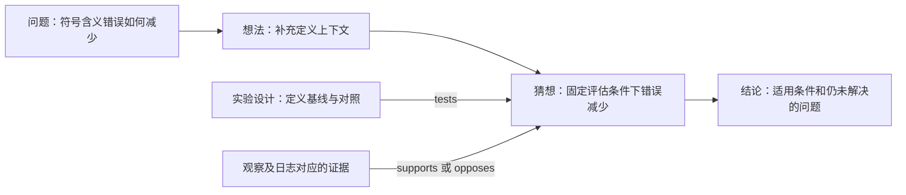

# 连续阅读与思考块设计

已批准设计基线 v0.3 · 2026-09-17 · [总体设计](学习系统设计方案.md) / [存储规范](内容分块与存储规范.md)

本设计已获用户批准；交付与验收安排见[设计批准与实施路线](设计批准与实施路线.md)。

本版将阅读、笔记与思考放进同一条连续内容流。知识、笔记、图片、问题、想法和猜想都能独立引用和更新；块之间可以建立有含义、有方向、有版本的关系。阅读时看到完整上下文，整理时可以抽取自己的思考，研究时可以沿证据关系追踪结论。

本文保留批准的交互与数据契约示例。2026-09-30 现状：个人层、阅读、关系与认识审查的 Rust/PostgreSQL 内核已完成相应隔离验收，编辑器和浏览器页面待建设；最新实现边界见[架构文档入口](KnowWeave架构设计总览.md)，不能把所有目标示例视为现有接口。

## 1. 使用体验：在阅读发生的位置思考

默认打开“融合阅读”视图：原文与个人插入块连续显示，边距、文字标签和轻量样式区分来源与用途。

```text
Attention 的因果约束                          [融合阅读 ▾]

原文 · 机制说明
位置 t 的输出只能使用允许访问的输入位置……

             ＋ 在这里插入

│ 我的笔记
│ 用小型矩阵先检查屏蔽方向，再扩大到实际输入。

│ 我的图片 · 实验截图
│ [矩阵可视化]                   图注：输入与运行条件……

┆ 猜想 · 待验证
┆ 在指定条件下，改变某项设置可能导致输出偏差……
┆ [设计验证] [关联证据] [关系 3]

原文 · 实现示例
……

│ 块引用 · 另一篇笔记中的“广播规则”
│ [展开原块] [跳转上下文]          固定引用某个修订版

原文 · 后续推导
……
```

这是交互示意，不是对实际课程内容的引用。版面以连续阅读为主；原文不被全部包装成带边框卡片。个人内容使用侧边标记、标签和适度缩进，猜想等需要状态辨识的内容再增加轻量样式。

同一内容提供四种视图：

| 视图 | 显示内容 | 适用场景 |
|---|---|---|
| 融合阅读（默认） | 原文 + 选定个人插入层 | 边读边思考，保留上下文 |
| 原文 | 只有所选原文版本 | 连贯重读、核对来源 |
| 我的思考 | 笔记、想法、猜想、图片及必要原文引用 | 复盘、写报告、跨资料整理 |
| 关系视图 | 当前块附近的链接、支持/反对、问题与来源 | 追踪推理、找缺口与反例 |

切换视图只影响展示，不删除内容、不更改源文档。学习进度也不因隐藏了个人内容而重置。

## 2. 选择“原文 + 个人插入层”

| 组合方式 | 适合场景 | 代价与本版选择 |
|---|---|---|
| 直接向原文组合插入块 | 正在编写自己的文章 | 每次插入都会改该文档结构；保留为“编辑原文”的明确模式 |
| **固定原文 + 独立个人插入层** | 阅读课程、讲义、手册时随手记录 | 需要位置映射；**作为默认阅读模式** |
| 派生一份个人组合 | 跨文档重排、重新组织一章、形成专题笔记 | 结构由自己维护；作为“整理成我的专题”的动作 |

个人插入层不是一次性批注缓存。它是有身份、有修订、可备份的个人编排数据，引用独立的块正文。一个人可以给同一份材料建立“初学”“项目复习”等不同插入层，默认只建立一个，避免一开始增加管理负担。

```text
原文组合的固定版本        个人插入层的固定版本
   A → B → C             A 后：笔记 N、图片 I、猜想 H
         \                         /
          融合阅读视图：A → N → I → H → B → C
```

原文块与个人块使用统一块模型，但归属、来源、权限和版本分别保存。原文属于自己的情况，也默认在“学习”模式插入个人内容；用户进入“编辑原文”模式后才直接修改源组合。界面始终显示当前编辑范围。

PDF 的融合阅读有两条可行路径：对已形成规范块的内容在块间插入；对未拆解原件，以页、页面片段或原件引用卡作为块间边界。记录不会直接写进 PDF 的二进制字节；原件版式阅读可同步显示相应页的个人内容。

## 3. “是什么形式”和“有什么用途”分开

为了让扩展保持一致，块至少有以下独立维度：

| 维度 | 示例 | 决定什么 |
|---|---|---|
| `kind` 内容形式 | text、figure、formula、code、table、exercise、block_ref、relation_view | 编辑器、渲染器和字段校验 |
| `intent` 思考用途 | knowledge、note、question、idea、conjecture、observation、evidence、conclusion | 标签、组织与可用操作 |
| 来源与作者 | 课程原件、本人原创、AI 辅助草稿、外部引用 | 来源提示与可追溯性 |
| 生命周期 | 草稿、已保存、进入某个发布快照 | 编辑和版本状态 |
| 认识状态 | 待验证、验证中、证据不足、条件内获支持、条件内被反驳 | 仅适用的猜想/结论审查记录 |
| 归属与可见范围 | 私有空间、指定导出范围 | 谁能读取与分享 |

“知识”表示内容的用途，不代表已证明；“证据”表示它被用于支持某项判断，不代表它充分可靠。课程出处、AI 来源、审查记录与认识状态都要分别可见。

已有 `role=warning / definition / example` 等保留为文字的表现角色，不代替 `intent`。一张图片可以是知识插图，也可以是个人观察；将“我的想法”改成“猜想”，并不会改变它的图片/文本媒介，也不会自动增加可信程度。

### 首批用途及操作

| 用途 | 最少输入 | 后续可做 |
|---|---|---|
| 笔记 | 一段自己的解释或提醒 | 引用、复用、整理成总结 |
| 问题 | 想澄清的问题 | 关联回答、原文、反例和未解决点 |
| 想法 | 一个直觉、联想或可能方向 | 添加依据，发展为可检验猜想 |
| 猜想 | 一项暂未确定的判断 | 补条件、预测、验证计划和支持/反对证据 |
| 观察 | 看到了什么，以及对应情境 | 关联实验、图片、日志与不确定性 |
| 证据 | 产物/观察/来源及为何相关 | 支持或反对某个具体版本的判断 |
| 结论 | 在哪些条件下作出的判断 | 链接依据、限制、未决问题与替代结论 |

捕捉灵感时只需一句话即可保存。复杂字段逐步填写；没有可检验条件的“猜想草稿”明确提示待补充，但不阻止记录想法。

## 4. 插入、移动、引用与删除

块前后都有可访问的插入位置，包括文档开头、结尾、连续个人块之间和折叠分组边界。嵌套章节的插入位置属于明确章节；如果要进入引用块内部插入，则需打开它的原上下文或派生组合，避免误改别处内容。

常用动作：

1. 点击块间“＋”，选择笔记、图片、问题、想法、猜想或块引用；键盘焦点和移动端也能找到入口。
2. 使用插入菜单或 `/` 命令选择类型；用块搜索或 `[[` 入口寻找可引用块。
3. 粘贴/拖入图片时明确落点，生成上传状态；原图保存为资产，图注和用途保存在 figure 块。
4. 编辑个人块自动保存，服务端返回修订号后显示已保存；不要求每写一条笔记都手动发布整篇文档。
5. 将已存在的块插入另一处时选择“引用此块”；需要不同内容时选择“派生副本”，显示来源关系。
6. 移动改变的是该次出现的位置；从页面移除只移除此处引用。删除块本身是单独操作，并先显示被引用范围。

图片上传失败时正文可保存草稿，但该图显示未就绪；恢复后用同一上传请求关联资产，不留下假装可读的空图。连续创建多个块或插入一组笔记时，以同一事务保存位置与已就绪块引用。

对猜想新增“支持/反对证据”时，先选具体证据块，再说明为什么相关。仅在它旁边插入一张图片，不自动认定该图片支持猜想。

## 5. 外观区分与阅读密度

| 内容 | 建议表现 | 保留的文字标识 |
|---|---|---|
| 原文/知识 | 中性底色、正常正文宽度，来源低干扰显示 | 来源、用途；需要时展开版本 |
| 我的笔记 | 蓝色细侧线、轻微底色或缩进 | 我的笔记 |
| 问题 | 问号标记，简短状态 | 待解答 / 已有回答 / 仍有疑点 |
| 想法 | 紫色小标记，布局仍接近普通正文 | 想法 |
| 猜想 | 琥珀色标记、细虚线或状态条 | 猜想及明确的认识状态 |
| 观察/证据 | 中性或青色标记，突出条件与来源 | 观察 / 证据；支持/反对关系用文字 |
| 结论 | 轻量标题和依据入口 | 结论、适用条件、审查状态 |
| 引用/关系视图 | 目标标题、关系标签、上下文入口 | 引用自哪里 / 哪项关系 |

颜色只作辅助，同时提供文字标签、图标和边界形状。键盘操作、触屏入口、深色主题与打印样式均应保留身份辨识；实际对比度与可读性在实现时检查。

允许折叠个人块、只看未解决问题、按用途筛选；筛选后保留原位置标记和“展开附近原文”。否则独立的一条笔记可能失去它回应的前提。

同一块在不同视图中使用相同用途与来源标识。图片并不固定一种外观，其外框继承该块用途；一张猜想示意图仍应标为猜想。

## 6. 位置是独立数据，原文变化时可恢复

正文回答“写了什么”，出现位置回答“在何处阅读到它”。增加个人插入层后，需要分别保存：

- `Overlay / OverlayRevision`：某人的插入层及不可变修订，绑定原文基线版本。
- `Placement`：个人块在该层中的一次出现，有独立 ID 和固定块修订引用。
- `GapAnchor`：定位原文间隙，包含根组合、原文基线修订、嵌套 occurrence 路径、左右邻居及附着偏好。
- `ReadingViewRevision`：固定原文版本、插入层版本、所选关系修订和展示配置，用于复现一份融合阅读快照。

下面是设计用的位置例子。两个邻居是同一原文组合根层的 occurrence，与存储规范的 Attention 组合示例对应；一个间隙可容纳多个个人块，由该组的有序 placement 列表排列。

```json
{
  "placement_id": "place_note_1",
  "block_ref": {
    "block_id": "blk_my_note",
    "revision_id": "rev_my_note_2"
  },
  "gap_anchor": {
    "base_composition_id": "doc_attention",
    "base_revision_id": "docrev_attention_8",
    "parent_occurrence_path": [],
    "left_occurrence_id": "occ_rule",
    "right_occurrence_id": "occ_mask",
    "affinity": "after_left"
  },
  "local_group_order": 0
}
```

`local_group_order` 是导出时的有序位置，不是跨版本身份；运行时由服务端维护顺序。根级路径为空数组，文首左邻居为 null，文末右邻居为 null；空文档两侧均为空，仍有明确根组合范围。在个人块之间插入，调整同组 placement 顺序；迁移原文时按该组整体移动，保留组内顺序。

嵌套的同一个子组合出现两次时，完整 occurrence 路径区分两处。重排保留 occurrence ID；将一处复制到另一处创建新的 occurrence ID，不能把个人块意外复制到每次出现的位置。

### 原文升级后的定位规则

原文没有升级时，个人层继续使用原基线。接受新版才创建新的个人层基线与迁移记录。

| 原文变化 | 处理 |
|---|---|
| 左右邻居不变且仍相邻 | 可精确恢复间隙，记录迁移 |
| 左右之间新增原文块 | 依原保存的附着偏好提出位置，并展示前后文差异 |
| 仅一侧邻居存在 | 生成候选，不仅凭一个旧 ID 无提示迁移 |
| 两侧发生拆分、合并或跨章节移动 | 使用谱系与上下文生成候选，等待确认 |
| 没有可靠位置 | 内容保留在“待重新放置”，可从旧版原位置打开 |

默认两个邻居之间插入采用 `after_left`；用户可改为 `before_right`。一份图文组合有多个 placement 时整体维持顺序。精确迁移、候选迁移、拒绝与手工放置都保留历史。

当前层不自动跟随新版原文，所以尚未确认的位置不会破坏正在阅读的页面。若用户决定先使用新基线而暂不安置部分个人块，页面持续显示待放置数量与入口，内容仍在个人块库中可搜索。

## 7. 块链接、块引用、块关系

| 能力 | 回答的问题 | 表现 |
|---|---|---|
| 块链接 | 相关内容在哪里？ | 行内链接、悬停/点按预览、跳转原上下文 |
| 块引用 | 我想在这里阅读同一份内容 | 链接卡、摘要或内嵌内容，固定引用目标版本 |
| 块关系 | 两个内容为什么相关？ | 带类型、方向、说明与审查状态的关系 |

行内块链接通过块搜索选择目标，保存目标 block ID 和 revision ID；显示标题是可更新的展示信息，不是身份。可额外保存原上下文 occurrence 路径，点击时既能看独立块，也能返回它所在的文章。另提供“查看新版”，避免将跳转最新内容与复现原引用混为一件事。

直接复用一个块时，组合只需增加该块的 occurrence。如果需要一张具有自身说明、标题或展示选项的引用卡，可以使用 `kind=block_ref` 块，其正文保存目标引用和 `display=link/card/embed`，不另存一份目标正文。v0.2 中组合节点的 `type=block_ref` 是结构引用；这里的块类型是可编辑引用卡，两者使用不同 Schema。

内嵌引用发生递归时，达到展示深度上限便转为链接；遇到引用环立即显示返回入口。关系图允许存在环，不因此无限展开页面。首版可将连续内嵌深度限制为两层，用户仍可点击继续阅读。

系统提供反向链接：哪些有权限的文档、个人层或块引用了当前块。默认按身份聚合，同时显示具体引用版本；旧版反向链接不能伪装为对新版的支持。

## 8. 关系是独立可维护的记录

每条明确关系都有自己的 ID 和修订：关系改变不要求重写两个端点的正文。首批关系词汇如下。

| 关系 | 方向与含义 | 不代表什么 |
|---|---|---|
| `annotates` 注释 | 笔记 → 被解释的块 | 不自动表示同意 |
| `questions` 提问 | 问题 → 被追问的块 | 不自动判定对方错误 |
| `answers` 回答 | 回答/结论 → 问题 | 有回答不等于问题已被充分解决 |
| `inspired_by` 启发 | 新想法 → 启发来源 | 不表示来源支持新想法 |
| `supports` 支持 | 证据/理由 → 判断或猜想 | 支持不等于证明 |
| `opposes` 反对 | 反例/理由 → 判断或猜想 | 是否足以推翻需检查条件 |
| `tests` 验证 | 练习/实验设计块 → 猜想 | 计划验证不表示已经得到结果 |
| `related_to` 相关 | 无方向的关联 | 不等同于先修、因果或逻辑蕴涵 |
| `derived_from` 派生 | 新块 → 原块 | 记录复用/改编谱系，由相应操作生成 |

`derived_from` 等系统谱系关系只允许通过对应派生/拆分/合并操作改变；主观联想使用 `inspired_by`。有向关系同时提供正反方向的中文显示，不重复存一条反向边；对称的 `related_to` 按标准端点顺序保存并防止等价重复。

### 关系记录

| 字段 | 作用 |
|---|---|
| relation_id / relation_revision_id | 稳定身份与不可变修订 |
| from / to | 端点块及确切修订；可附块内范围 |
| type | 有登记定义的关系类型 |
| rationale | 为什么建立这条关系，可很短，支持后续细化 |
| conditions | 适用数据、假设、实验环境或判断范围 |
| author / origin | 本人建立、导入或 AI 建议；系统谱系另标识 |
| scope | 私有空间、学习实例、个人层或专题的适用范围 |
| review_record | 未复核、已复核、需重查、已撤回等审查记录 |
| created_at / supersedes | 时间和替代关系，不覆盖历史 |

示例是虚构关系，仅说明数据结构；没有对应已完成的实验。

```json
{
  "relation_id": "rel_evidence_hypothesis",
  "relation_revision_id": "relrev_evidence_hypothesis_1",
  "type": "supports",
  "from": {
    "block_id": "blk_evidence",
    "revision_id": "rev_evidence_1"
  },
  "to": {
    "block_id": "blk_hypothesis",
    "revision_id": "rev_hypothesis_2"
  },
  "rationale": "该虚构对照记录沿用相同评估规则，观察方向与预测一致，但样本范围有限。",
  "conditions": {
    "scope_text": "仅适用于所记录的模型、提示、测试集与评估规则"
  },
  "origin": "user_asserted",
  "scope": {
    "workspace_id": "workspace_private_demo",
    "overlay_id": "overlay_attention_demo"
  },
  "review_record": {
    "state": "unreviewed",
    "reviewer_id": null
  }
}
```

端点本身标明版本，关系的审查记录也独立留痕。猜想从修订 2 改为修订 3 时，旧关系仍指向修订 2；若用户查看新版则展示“另有旧版关系”，并可提出迁移候选。不能自动把旧实验结果当作新命题的有效证据。

示例中的 `review_record` 是一次读取/导出的关联审查结果；在线审查存于独立记录，更新审查不会原地改变不可变的关系修订正文。

无需一次填完所有关系字段。“相关”可以一键建立；支持/反对建议补充理由与条件，缺失时标为待复核。AI 推荐的关系先在候选区展示，经接纳才加入个人关系集。

### 关系族分开管理

1. **位置与包含关系**来自组合和个人层，确定页面顺序；相邻不会自动生成语义关系。
2. **内容依赖**如 `requires_context` 来自正文修订的声明，影响完整性校验。
3. **知识与思考关系**使用上面的独立 Relation，对阅读和推理提供解释。
4. **学习先修**连接能力或学习定义，决定任务可执行性；普通“相关”不进入硬先修图。

界面可在一个关系面板展示四类关系，但各自只有一处权威存储。系统生成的位置、来源与依赖信息标明只读来源；用户增删一条“相关”不会重写文档顺序。

## 9. 从想法到有条件结论

猜想块可以逐渐补充以下字段，正文仍按块独立维护：

| 字段 | 要回答的问题 |
|---|---|
| statement | 我具体猜测什么？ |
| assumptions / scope | 在什么条件下？ |
| prediction | 如果猜想成立，应该观察到什么？ |
| counterevidence | 出现什么结果会使我降低信心或否定该版本？ |
| validation_plan_refs | 怎样验证，关联哪些实验或练习？ |
| evidence_relations | 哪些材料支持或反对？ |
| assessment_refs | 谁在何时基于什么作出判断？ |

认识状态不直接写成一个可随意改动、覆盖历史的真值字段。通过 EpistemicReview 记录对特定猜想修订及证据快照的判断：`untested / testing / inconclusive / supported_within_scope / refuted_within_scope / superseded`。当前显示状态来自所选有效审查记录，过往记录始终保留。

“已经保存”“老师课件中的原文”“我给出的高信心”“有一条 supports 关系”和“在明确条件下获得支持”分别表达不同信息。首版不使用一个合成分数替代它们，也不按支持链接数量自动确定真假。

示例研究过程围绕一个尚未验证的问题：**检索片段加入符号解释，是否能减少回答中的符号含义错误？**



图中的时间演进箭头表示工作过程，只有标注类型的边是具体关系示例；工作顺序本身不宣称逻辑证明。

如果证据不足，可以保留“证据不足”的结论并继续观察；如果猜想需要收窄，则创建修订并复核原关系。不同解释可以并存，分别关联支持与反对证据。新的知识总结块可以引用猜想、审查和证据链，旧想法与失败尝试不被覆盖。

能力验收与猜想判断仍是两件事：一次实验可能反驳猜想，却证明学习者能够设计合理对照；“理解/实现/测量/迁移”的学习证据不以猜想是否被支持来决定通过。

## 10. 关系如何出现在页面里

每块默认只显示少量动作和关系计数。点击后打开侧栏：被谁引用、它引用谁、相关问题、支持/反对、来源与适用版本。可按关系类型和状态筛选，优先展示当前块一跳邻居，更多内容分页或展开。

“关系块”实现为 `kind=relation_view`：正文保存明确的关系引用列表，或工作区内的查询定义。它是关系记录的展示窗口，不存第二套可独立编辑的关系事实。

例如在猜想下方插入一块“支持与反对的证据”，左右或上下分组列出当前选中的关系。普通视图可按权限查询最近关系，并显示查询范围与更新时间；分享、正式发布、实验引用和导出时，必须解析为固定的关系修订清单。

动态查询只属于当前个人工作视图；生成 ReadingViewRevision 时保存当时解析出的关系清单。之后刷新查询可以形成新快照，既有快照不会因新建关系而变化。

关系视图本身可以像其它块一样移动、折叠、引用，但不自动成为它所展示命题的证据。编辑关系通过 Relation 接口保存，原关系卡和侧栏随当前视图所选关系版本一致显示。

全库图谱作为后续可选探索视图。首版以正文、反向链接和局部关系面板服务实际阅读，避免进入页面先面对难以阅读的大图。

## 11. 保存、复用、导出与权限

### 保存与并发

当前个人工作视图的每次保存可生成新块修订、个人层修订和视图修订，事务性更新当前工作头。日常笔记自动保存，不需要手动发布；导出和重要实验引用选择固定视图修订。

同一笔记在别的固定组合中也出现时，编辑当前处只更新当前个人工作视图引用，其它固定版本继续可复现，并提示有新版。用户可以选择哪些其它工作视图升级；不会由一次笔记修改静默改写所有历史快照。

位置操作提交基础个人层修订及幂等键。两设备在同一间隙同时插入时，第二次冲突返回新顺序，保留未提交正文，用户重新定位；首版不承诺自动合并或实时协作算法。与不同块正文的并发分别处理。

图像替换创建新资产及 figure 修订；移动图片不产生新的图片字节。跨文档整理默认复用块身份，跨领域再用同一条想法也不复制正文。

### 导出

- **原文快照：**只包含选定原文发布版。
- **融合学习快照：**包含原文基线、个人层、块、关系修订和所需资产，生成一篇保留外观标签的 HTML/Markdown 阅读视图。
- **个人思考包：**包含选定个人块、关系与必要上下文引用；不必复制全部原课件。
- **完整备份：**包含所有权威正文、原件、个人层、位置映射、关系、认识审查、学习记录与历史版本。

模板包默认继续排除个人层；用户选择导出融合内容时，预览包含哪些个人记录及是否携带原件。引用目标没有导出权限或资产未包含时使用明确链接/占位，不复制私有目标正文来补齐表面完整。

检索、AI 上下文、反向链接与图谱均按权限和选定视图版本筛选。仅看原文时的答疑默认使用原文范围；使用“融合内容”时应标出原文、个人猜想和观察各自角色，避免把未证实猜想当作参考事实。

## 12. 与现有设计的衔接及首版验收

新增数据对象：

| 对象 | 责任 |
|---|---|
| BlockRevision.intent / semantic_payload | 统一块用途；猜想、问题和结论的可选结构字段 |
| Overlay / OverlayRevision | 个人插入层及固定原文基线 |
| Placement / GapAnchor | 个人块的具体出现、组内顺序和间隙定位 |
| ReadingView / ReadingViewRevision | 组合原文、个人层和关系版本的阅读工作区/快照 |
| Relation / RelationRevision | 用户语义关系与只读系统谱系的可追溯表示 |
| EpistemicReview | 对指定猜想/结论与证据版本的条件化审查 |
| PlacementMigration | 原文升级后的位置候选、确认与回退历史 |

个人笔记正文只存在于 BlockRevision。已有 Note 可以保留为集合/元数据入口，但不再拥有另一套 note.body；Annotation 表达对内容范围的批注锚点，Placement 表达页面插入位置，二者可以关联同一个块，也可以独立存在。

已有 `block_revision.relations` 仅用于正文自带的确定依赖，如 `requires_context`，其索引同事务生成。用户维护的支持/反对/启发等关系进入独立 Relation；组合引用和能力先修保留各自的数据模型。

首版先完成“融合阅读、间隙插入、笔记/图片/想法/猜想、块引用、反向链接、基础关系与版本保存”。猜想自动分析、复杂图谱布局、多用户协作和完整离线编辑后续按实际需求扩展。

需要在实现时验证：

1. 在文首、文尾、原文块之间、两条个人笔记之间插入内容，刷新和跨设备后顺序相同。
2. 插入图片时保留原字节、用途和图注；上传中断可重试，移动不复制原件。
3. 原文、笔记、猜想在浅色/深色/打印中通过标签仍可区分；键盘和触屏能完成插入。
4. 隐藏个人层后原文完整，重新打开个人层内容与位置恢复。
5. 同一个原文块在两处出现，笔记只显示在选择的 occurrence 路径下。
6. 原文插入新块、重排、拆分或删除后，个人内容保留；确定迁移有记录，不确定项可重新放置。
7. 两个设备同时在同一间隙插入不会静默覆盖，失败请求的正文可继续提交。
8. 修改猜想正文后，原支持关系仍指向旧版，当前视图明确提示复核。
9. 提出猜想、记录观察、建立支持与反对关系、得出条件化结论的过程可完整回看。
10. 内嵌引用出现环时页面不无限递归；反向链接不泄露不可见内容或数量。
11. “从当前页移除”不删除块在另一篇文档中的引用；块删除与关系撤回有不同操作。
12. 融合快照导出再导入，固定块、原件、位置、关系和审查版本一致；模板包不夹带个人层。

这些是设计验收条件，当前没有运行对应应用测试。后续实现的第一个样例应同时验证连续阅读与关系演进，再批量处理已有课程库。
